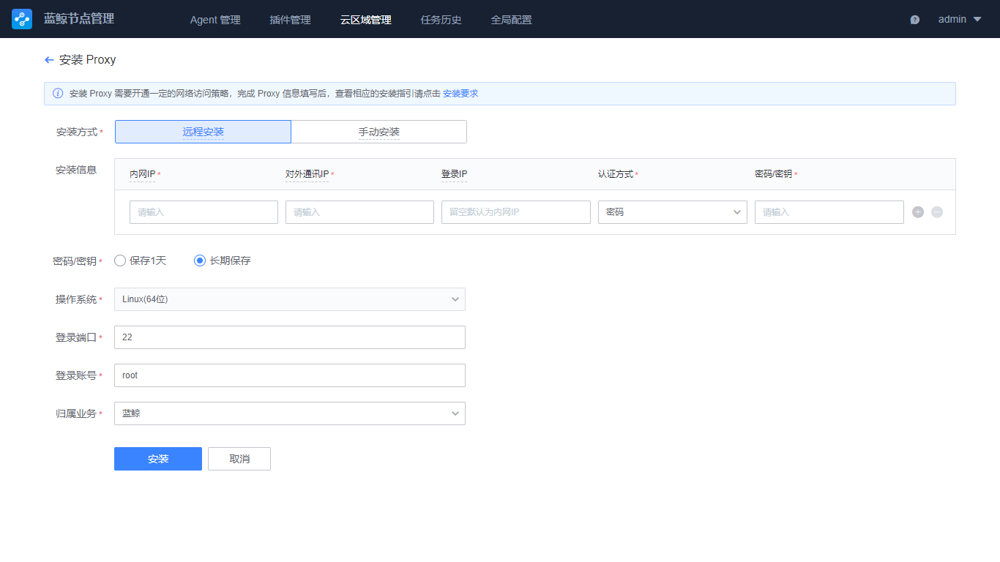

# Install BlueKing Agent (Custom Cloud Area)

Background: When the target CVM where the Agent needs to be installed cannot be directly accessed by BlueKing, you need to install the Agent pass create a custom cloud area.

## Step 1: Confirm the access point Configuration

Click "Global Setting" to confirm that the following configurations of the default access point are not blank, and the target CVM where the BlueKing Agent will be installed can connect to the private network addresses of these configurations.

## Step 2: Create a Cloud Area

On the Cloud Area Manage page, click "New" to create a new cloud region. Explanation of cloud area parameters:

After a successful submit, the system will prompt to "Continue Install Proxy". Select "Continue Proxy Install" to configure the proxy.

Fill in the proxy install parameters according to the instructions, click Install to enter the Task Details page, wait for the successful installation, and proceed to the next step.

## Step 3: Install Agent

Switch to the Agent Manage page and click the "Install Agent" button.

To install a business name, select a service that has been created on the Configuration System. If there is none service, you can select Resource Pool.

Cloud area, the cloud zone you just created, and use the default access point for the access point.

Then complete the target host details configuration for the installation. When complete, click Install to begin the installation checks.

## Step 4: Check the Implementation Status

After Step 3 is complete, you will automatically jump to the checks page and wait for the success Agent installation. If the checks fail, you can click on the host to view the install log.

