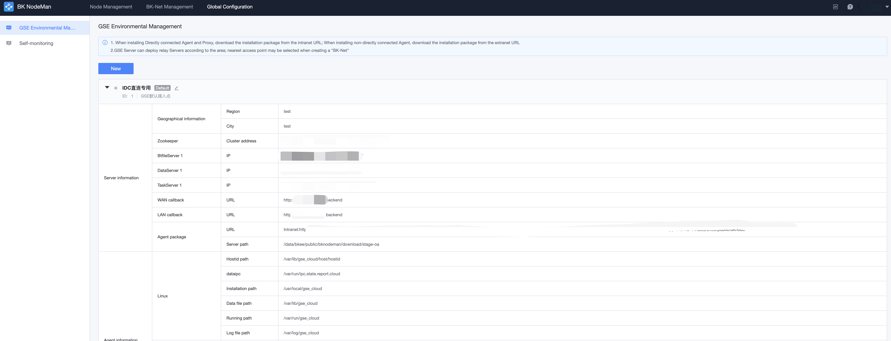
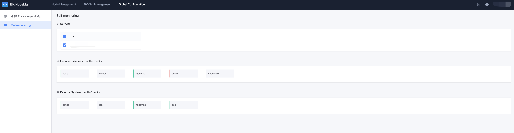

# Global Setting 

Global setting is a common configuration for NodeMan, which is generally set by the administrator. 
It is divided into GSE stage configuration and checks configuration. 

## GSE Stage Configuration 

Each access point has a separate GSE stage configuration, and the initial deployment of BlueKing includes a default access point. 

Access point related parameters: 

- Region information: indicate the region ID and city ID of the current access point. After the improvement, the BlueKing agent can automatically select the optimal access point by comparing the region and city on the host.
- BTFileServer: BT file transfer service address 
- DataServer: data pipeline service address 
- TaskServer: checks pipeline service address 
- Install package: the address of the installation package of the agent. You need to confirm that this address can be accessed by the host. The private network address is used for direct mode host. The external network address is used for non-directly connected host connections. 

## Self-monitoring

Monitor the access point back-end server of nodeman and the state of relying on peripheral configuration.

