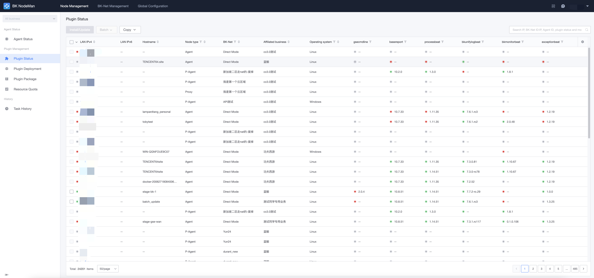
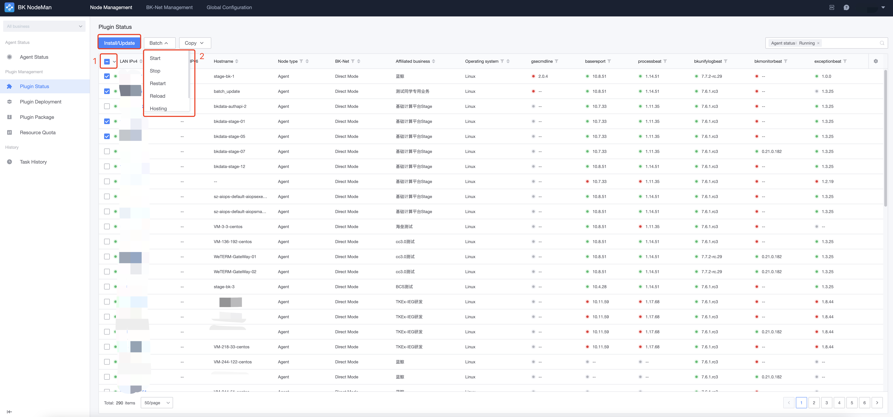
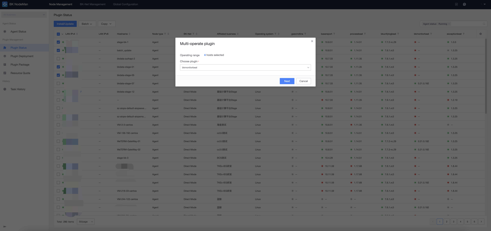
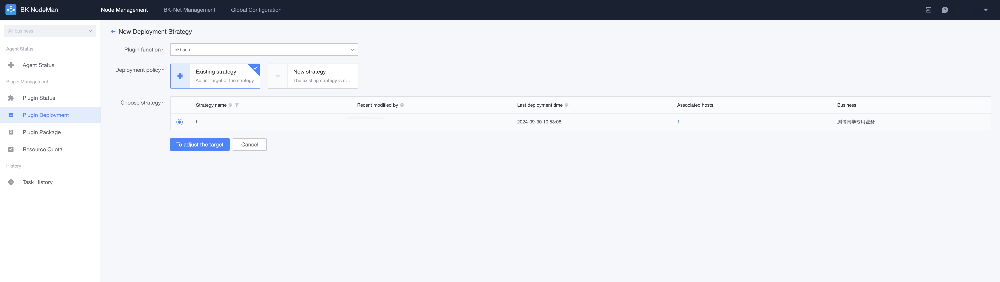
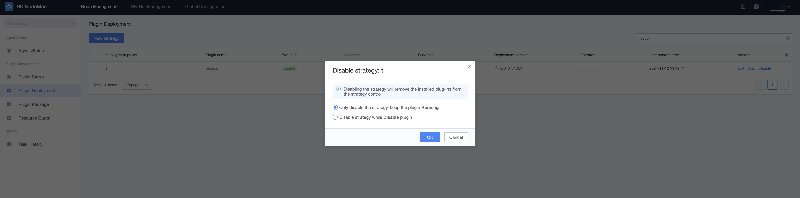
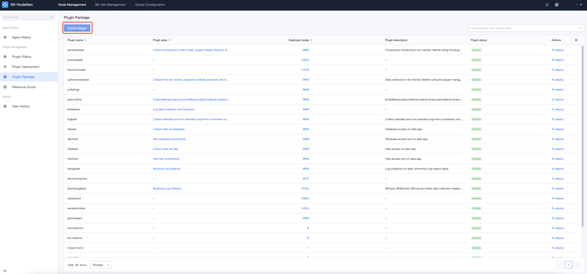
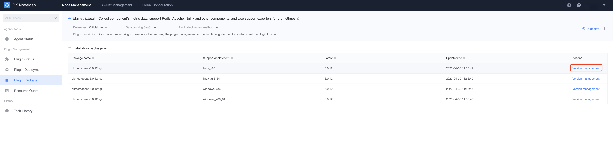

# Plugins 

A plugin is a subroutine or script that can be dispatched by the BlueKing Agent. BlueKing Agent will include some necessary plugins when it is installed on the host. 

You can deploy and manage these plugins via the Plugins feature or import more third-party plugins. 

## Query Plugins Status 

Click "Plugins" in the main navigation to enter the probes list page. 
On this page, you can query the running status and version information of each plugin on the current host based on the specified criteria. 

## Plugins Maintenance and Install 

**Step 1: Select the actions target** 

Select the CVM to be managed and click `installation` or `Batch`. 

**Step 2: Select an action** 

In the pop-up window, select the desired action and plugin. 

Maintenance of plugins includes the following actions: 

- Install/Update: Install or update plugin 
- run: runs the plugin process
- Stop: Stops the plugin process 
- Restart: Restart the plugin, plugin support is required 
- Overload: Usually used for configuration update, plugin support is required 
- Hosting: Registers the plugin with the GSE Agent for management. If the plugin process exits abnormally, the GSE Agent will try to pull the plugin automatically 
- Cancel: Cancels the management of the GSE Agent of the plugin. When the plugin exits abnormally, it will no longer be automatically pulled up 

## Deployment Alert Rules 

In addition to maintaining and managing plugins manually, you can also use `Deployment Alert Rules` to automatically install and manage plugins. 

A deployment alert rule defines a rule for plugin installation. Deployment alert rules include `target range`, `deploy plugins`, `plugin version`, `plugin parameter`, and other attributes. Plugins will be automatically deployed and installed on the CVM probes overridden by **target range** according to the rules defined by **deployment alert rules**. 

> Note: If the **plugins version** installed on the target CVM is inconsistent with the **alert rules version**, the deployment policy will force the target override to be overwritten and updated to the **policy version** 

If multiple deployment alert rules hit the same target range, **policy suppression** will occur, and only one deployment policy will take effect on the CVM. The rules that take effect depend on the target range of the deployment alert rules. The **finer** the target range, the **higher** the priority of the policy. 

> Alert rules suppression priority: 
> 
> Host> Modules> Set> Business Name 

If the same host is hit by two deployment alert rules, the target range of the policies is the same level. In this case, the deployment policy established first will take effect finally, and the policy established later will ignore this host. 

### New a Deployment Alert Rules 

Click the "Plugins" tab in the main navigation to enter the **deployment alert rules** page and click "New Alert Rules". 

**Step 1: Select the plugins to be deployed** 

If the selected plugins already have a deployment alert rule, the system will list the existing policies, and you can choose to modify them based on the existing policies. 

If the existing deployment alert rule does not meet the requirements, you can also select **New Alert Rules** 

**Step 2: Select the target range to be deployed**

In the target selector, you can choose to deploy plugins to the business name you have permissions to. 
> Note: **Dynamic Topology** and **Static IP** cannot be mixed when selecting target range.

**Step 3: Select plugins version**

According to the host range selected in step 1, the system will automatically select the corresponding plugins package according to the operation system and CPU architecture information. 

If multiple versions of the plugins package are available, click **Deployment Version** to select the version of the plug-in package to be installed. 

**Step 4: Parameter configuration**

Some plugins packages support custom parameter configuration. If you need to adjust the plugins package parameters, you can set custom parameters here. 

**Step 5: Preview**

After all parameters are filled in, this step will display all hosts by operation type. Once confirmed, click Next to save the deployment alert rules. 

> Note: If plugins have to pass manually install in the target range override by the deployment alert rules, the plug-in version and parameters defined in the deployment policy will prevail. After the target CVM is controlled by the deployment alert rules, plugins cannot pass performed manually. 

### Edit deployment alert rules

For existing deployment alert rules, you can adjust the following properties:
- Target range 
- Plugins version deployed 
- Plugins package parameters 

### Disable deployment alert rules

As described above, the deployment alert rules define a rule for automatic plugins install. For the CVMs override by the policy target scope, the NodeMan will automatically install the plug-in. If you want to suspend this automatic behavior, you can turn it off pass the `Disable` function of the alert rules. 

When you disable an alert rules, you can choose whether to keep plugins that have been deployed pass the policy:

- Only disable the alert rules and leave the plugins **running** 

The deployment alert rules will not generate any automatic behavior, and plugins that have been installed pass the deployment policy will continue to run and will not be affected by the disable of the policy. 

- Disable the alert rules and **disable** the plugins 

When you disable a deployment alert rules, you also deactivate the plugins install by the policy. This option will take you to the **Disable Preview** to confirm the plugins deactivation action. 

After the departmental policy is successfully deactivated, you can still click **Start Policy** in the policy list to restart the policy.

## Add a new plugins package to NodeMan 

**Step 1: Get the plugins package**

You can get the plugins package pass the following ways: 

1. [Smart Market](https://bk.tencent.com/s-mart/) on BlueKing Official 
2. Custom developed plugins pass the plugins development framework 

**Step 2: Upload plugins package**

Click "Plugins" tab in the navigation bar to enter the "Plug-in Package" page, click "Import Plug-in", and select or drag the plug-in package to be imported. 

Click "Import" button complete the plugins package after the system resolves success. 

**Step 3: Deploy the plugins package**

Only plugins packages that are set to the "official" version can be deployed to the host. 

In the plugins package list, click the plug-in alias to adjust the version status of the plug-in in the detail page. 

