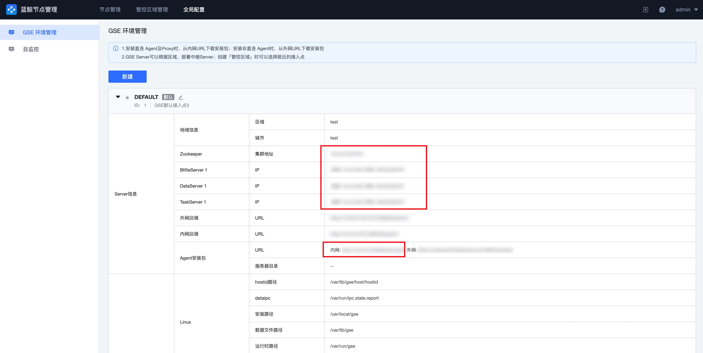
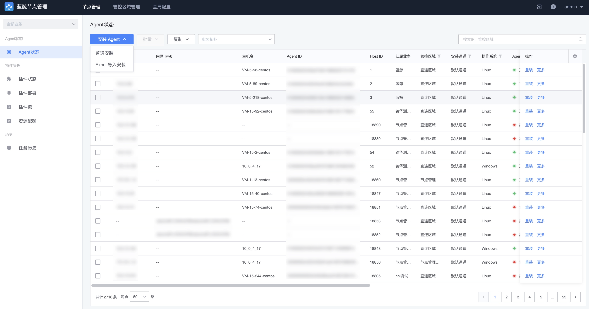

# Install BlueKing Agent (direct mode)

## Step 1: Confirm the access point Configuration

Click "Global Setting" to confirm that the following configurations of the default access point are not blank, and the target CVM where the BlueKing Agent will be installed can connect to the private network addresses of these configurations.

## Step 2: Install Agent remotely

Switch to the node Management->agent status page and click the Install Agent button.

To install a Business Name, select a service that has been created on the Configuration System. If there is no service, you can select Resource Pool.

Select "direct mode" for the BK-Net, and use the default access point.

Then complete the target Host details Configuration for the install. When complete, click Install to begin the installation checks.

## Step 3: Check the Implementation Status

After Step 2 is complete, you will automatically jump to the checks page and wait for the success Agent install. If the checks fail, you can click on the host to view the install log.

