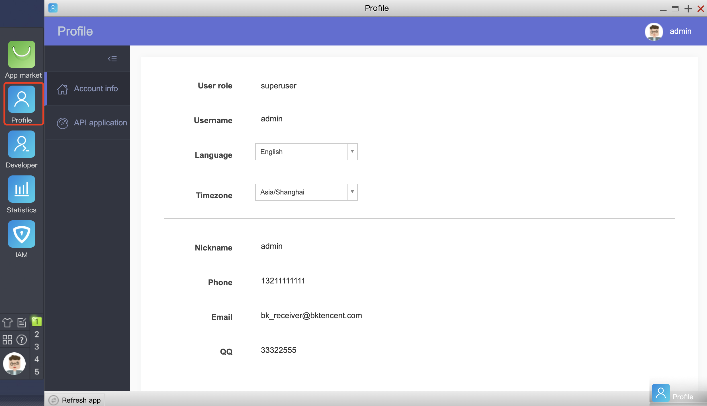

 # Profile

 The "Profile" provides basic functions such as personal information and changing passwords, while the more functional menus display different entrances according to the user's rights, with basic rights control.

  

 - **Administrator** 

  userManage: add, delete, modify and query users 
  
  Apply API: Approve API request document and view historical approval documents 

 - **Normal user** 

  For profile only. If the PaaS is setting up notification channels such as WeChat, you can use "Bind WeChat" to receive WeChat messages. 