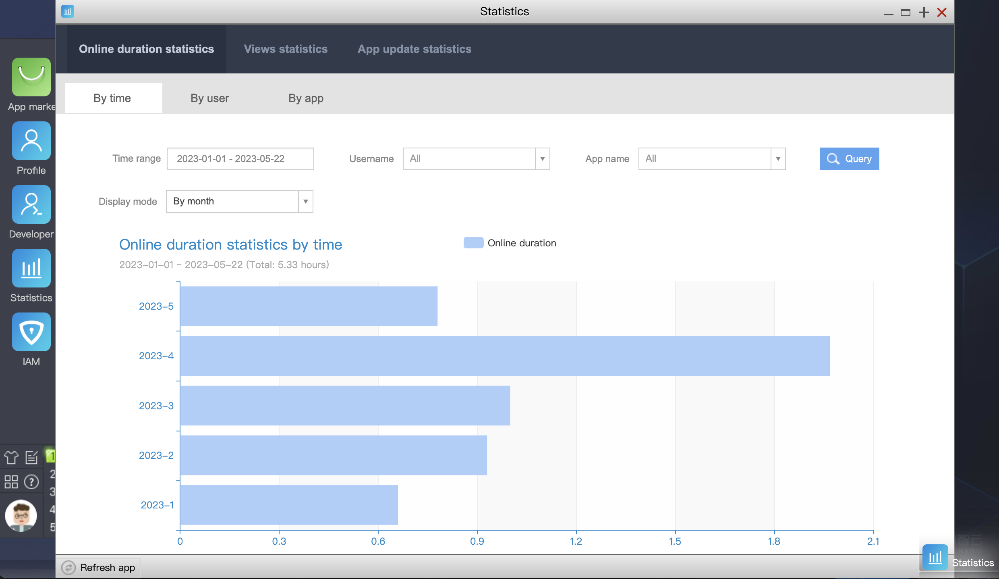

 # Statistics 

 This feature mainly displays the use case of all current applications and performs statistics on basic analysis, including online time, visits, activity, and SaaS application update, which can be sorted by time, user, and SaaS application name. 

  