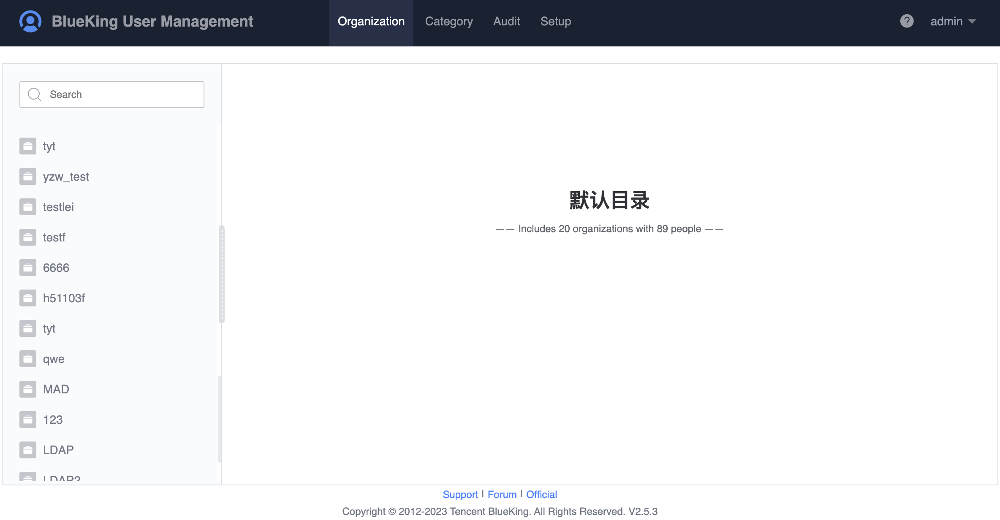

 # UserManagement

 UserManagement is a user and organisation management service provided by Blueking that allows you to manage your existing user organisation both locally and across your organisation.

  

 For detailed usage of the product, please refer to [White Paper on userManage of BlueKing Product System](../../../UserManage/UserGuide/Overview/Whatisbkuser.md). 