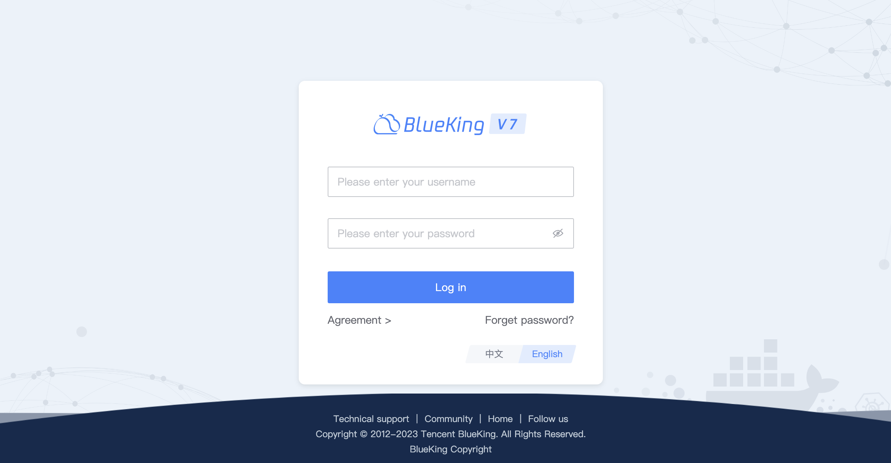

 # Personal Workbench 

 BlueKing provides a set of out-of-the-box SaaS applications that are presented in a unified manner on the user's "Personal Workbench", also known as the "Desktop". 

  

 The login interface provided items such as "View User Agreement", "Forgot Password", "Chinese and English Switch", etc. 

 ## Multi-Desktop Mode 

 5 desktops are provided by default, which can be saved according to personal conditions. click the flower icon to quickly enter the global perspective of 5 desktops, and drag and drop the icon to complete the adjustment of SaaS between different desktops. 

  

 In addition, it also provided the function input of "skin change", "quick guide" and "feedback". 

 ## Append operation 

 After clicking "append", "Add Apply" or "Add File" will appear. "Folder" is mainly used to classify SaaS on desktop. 

 "Append Append will open "Market", select the desired application to add. 

 Right click on the SaaS LOGO to "uninstall" the SaaS from the desktop. 

 ## Search 

 The search function is mainly aimed at SaaS applications in the market, helping the user to quickly find and view the details of The SaaS approved application market. 

