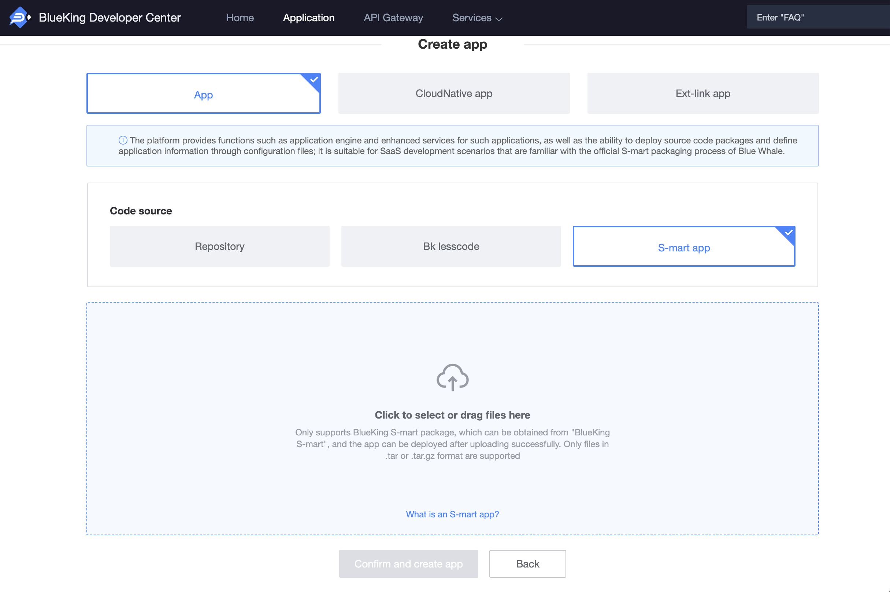

# Deploy Manage 

BlueKing PaaS supports many SaaS, which are divided into the following types according to SaaS deployment methods: 

### Type One: S-mart App 

The S-mart App can be used to approve download the SaaS package -> upload create application -> deploy (official environment)-> set the domain (optional)-> enter the workbench. 

 

 

### Type Two: Develop an application based on a code repository 

App, which is a SaaS application developed by the developer/user, and the code is hosted in the code repository. Self-develop the tool/system according to the way of "Create Apply-> R & D-> Staging Env Deploy-> Formal Environment Deployment". 

 

### The Three Type: BlueKing Lesscode Apply 

BlueKing Lesscode Apply can be deployed in the Developer Center after generating source code packages on the BlueKing visualization platform. 

### Four: Ext-Link App 

The platform provides market functions for such Apply. Third-party system can be registered in "BlueKing APP Market" and can apply Cloud API permissions, but it does not provide App Engine functions. Can be used for: 

1. To use a third-party system on BlueKing Desktop/Workbench, you need to set the third-party access URL. 

2. Only for applying API auth 
