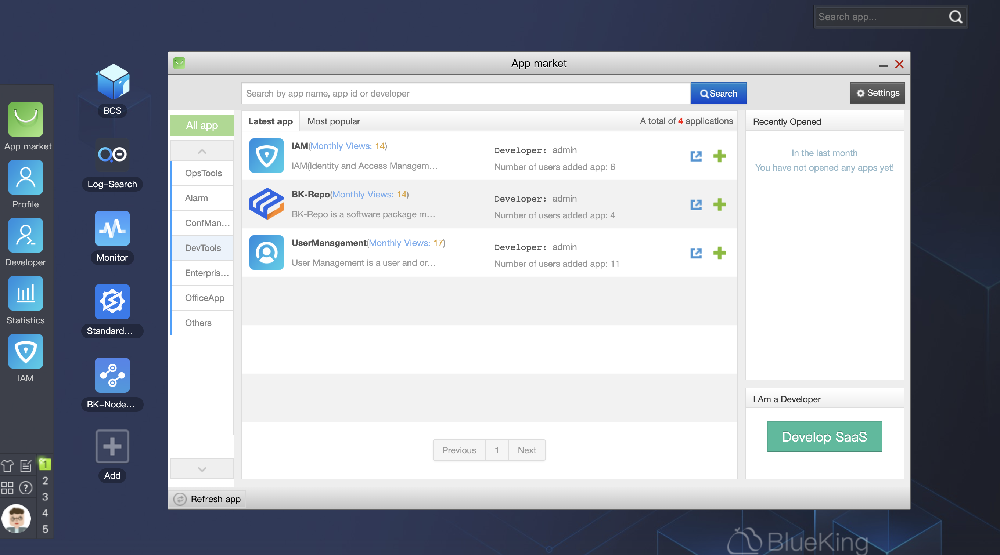

 # Use a SaaS from BlueKing 

 1. Access BlueKing "Workbench"/"Desktop" (if you are prompted for username/password, please contact the Administrator to applyPermission) 

 2.Click on the SaaS you are interested in to use (if you have any questions during the SaaS usage process, please contact the SaaS Developer/Operator) 

  