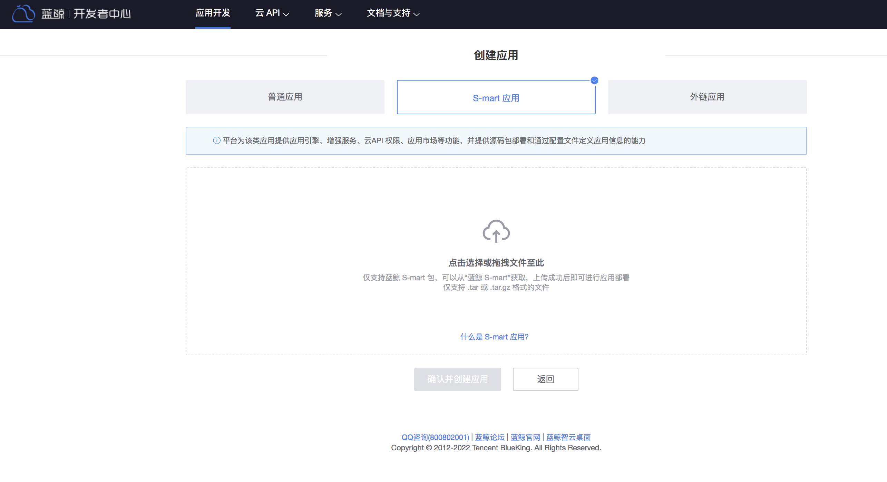
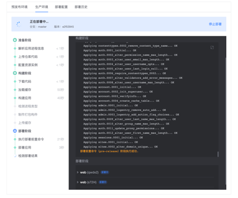

 # How to Deploy SaaS on BlueKing S-mart 

 1. Enter PaaS 3.0 Developer Center 

 2. click "Create application"

 3. click "S-mart App". 

 4. choose to download the SaaS package from BlueKing S-mart 

 5. click "Confirm and Create Apply". 
  

 6. After the application is successfully created, deploy the application on the Deployment Management page. 

  