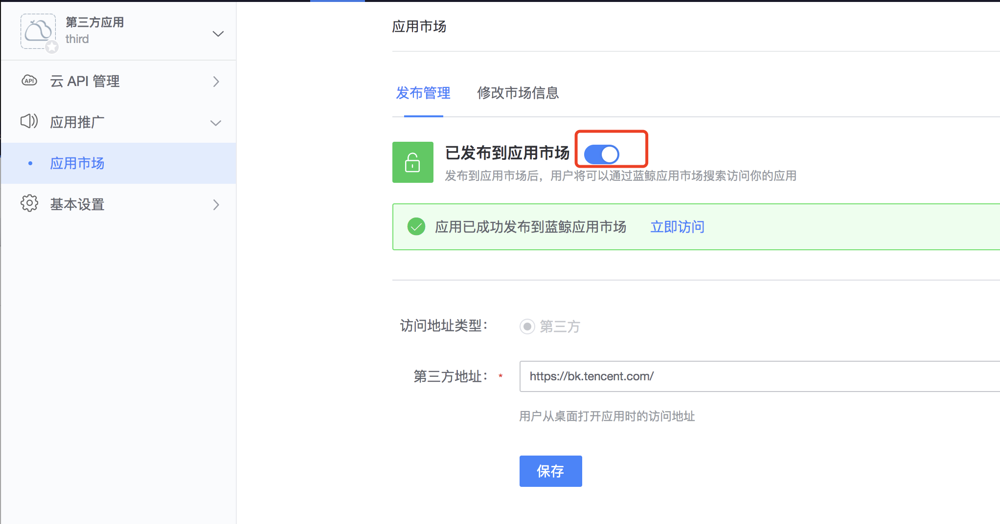

 # How to use a third party system on BlueKing Desktop/Workbench 

 1. click on "Create Apply"->"Ext-Link App" and fill in the "Third Party Address". 

  

 2. In "App Promotion" - "App Market", improve the application information and publish the application to the application market. 

  