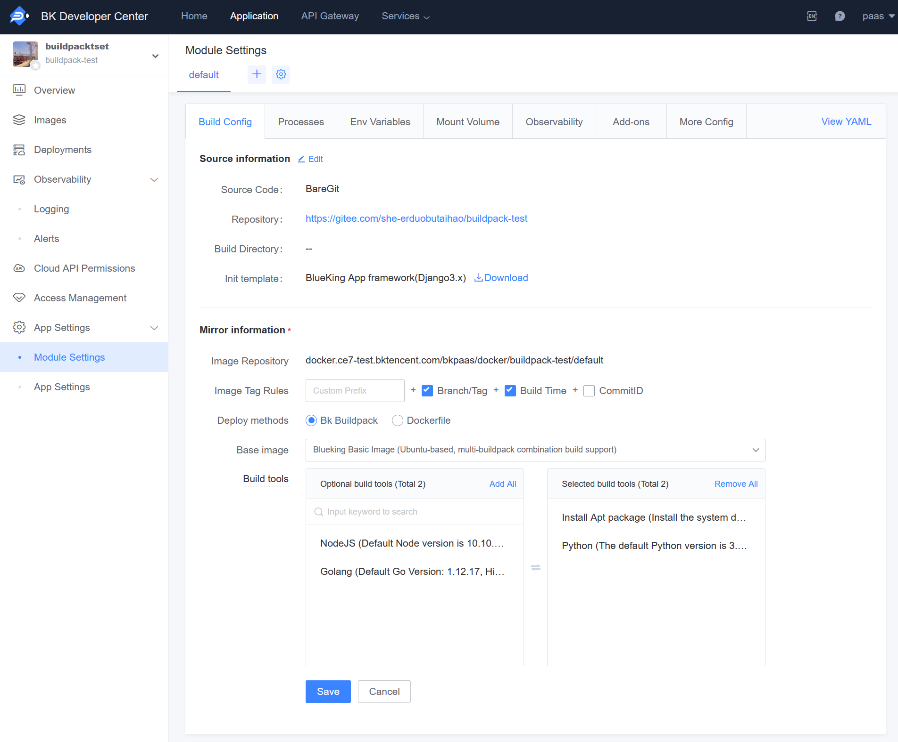

# Application Deployment Issues

### Application Deployment Error: Failed to parse application process information, reason: the file "Procfile" does not exist

Please check if there is a `Procfile` or `app_desc.yaml` file in the source code directory. If the file does not exist, please add it manually. You can refer to the relevant guide: [Application Processes](../topics/paas/process_procfile.md)

### Why is my Python application stuck during package installation?

First, check the last line of output before it gets stuck. Is it "Download" or "Running setup.py":

- If it's "Download," it means the download is slow or the network is experiencing issues. Please wait or retry;
- If it's "Running setup.py," please proceed to the next steps;

Check if there are any additional dependencies specified in `setup.py`:

```python
setup(
    setup_requires=[...],
)
```

Since the logic for installing with setuptools and pypi is independent, this will not use the source specified by pip, but will default to using pypi.python.org, which may be stuck due to network restrictions.

Try specifying a source for setuptools in pre-compile:

```bash
cat > ~/.pydistutils.cfg << EOF
[easy_install]
index_url = https://mirrors.cloud.tencent.com/pypi/simple/
EOF
```

Redeploying will correctly download the additional dependencies, but note that this only solves the network issue. There may still be installation failures.

For example, if the current package depends on setuptools>=38.6.0, you may encounter an error like this:

```bash
setuptools_scm.version.SetuptoolsOutdatedWarning: your setuptools is too old (<12)
```

This indicates that the current package's `setup.py` uses high-version setuptools features that cannot be upgraded. At this point, migrating to Python3 is the only way to completely resolve the issue.

## Common Deployment Error Fix Guide

### Fix Procfile Error (fix-procfile)

The `app_desc.yaml` or `Procfile` file is used to define the application process configuration file, which is located in the application's build directory (default is the root directory if not set). If you encounter a "Procfile error: " related error during deployment, please check if there is a valid `app_desc.yaml` or `Procfile` file in the application build directory. If the file does not exist in the build directory, create a `Procfile` or `app_desc.yaml` file and commit it to the source code repository.

It is recommended to use `app_desc.yaml` to define processes, with the following format:

```yaml
module:
  language: Python
  processes:
    web:
      command: gunicorn wsgi -b :$PORT --log-file -
    worker:
      command: python manage.py celery worker -l info
    beat:
      command of beat: python manage.py celery beat -l info
```

[View more content related to application processes](../topics/paas/process_procfile.md)

### Fix Python MySQL Module Installation Error (fix-pkg-install-mysql-python)

Some Python MySQL-related libraries are wrapped based on the C version of the development library, so it is necessary to install the relevant system packages for support. To install system packages, update the runtime configuration:

1. Access the Developer Center and enter the application details page.
2. Click on the left menu: "App Settings" - "Mudule Settings" - "Build Config".
3. Bind multiple build tool base images Ubuntu18 (BlueKing version) and the corresponding build tools to install system packages.

The build tools will be built one by one, so pay attention to the order in which the build tools are selected. For example, to use apt to install some system dependencies during the Python build, the installation of system packages must be placed before the Python environment:



Note: The build tools will be built one by one, make sure to place "Install System Packages" at the beginning.

Add an `Aptfile` to the code repository build directory (default is the root directory if not set), with the following content:

```txt
libssl-dev
default-libmysqlclient-dev
```

### Application Unable to Start Building (fix-unable-select-buildpack)

If you are using BlueKing V7, please first confirm whether you have completed the "Upload PaaS Runtimes to Artifact Repository" step. Please click on the version number to view the corresponding documentation:

- [7.0 Environment](../../../../DeploymentGuides/7.0/paas-upload-runtimes.md)
- [7.1 Environment](../../../../DeploymentGuides/7.1/paas-upload-runtimes.md)

The application project structure does not match the selected build tool. Please check and fix the project structure:

1. Whether the wrong build tool was selected;
2. Ensure that the dependency description file is located in the appropriate position in the project, generally located in the build directory (default is the root directory if not set), such as Python's `requirements.txt`, `Pipenv.lock` file, Node.js's `package.json` file, etc.

### Fix collectstatic Phase Error (fix-py-collect-static)

If you are developing a Django application, the platform will execute `python manage.py collectstatic` by default during the build phase to collect all static files.

If an error occurs during the command execution, please check:

Whether there are syntax errors or exceptions in the program that prevent it from starting. If so, please fix according to the specific error;
Whether there is a `STATIC_ROOT` configuration item in your Django configuration file. If not, add the configuration item and redeploy:

```bash
# It is recommended to use the /tmp temporary directory
STATIC_ROOT = '/tmp'
```

In addition, you can add a new environment variable `DISABLE_COLLECTSTATIC = 1` in the "Environment Configuration". This can skip the entire collectstatic phase. Unless absolutely necessary, it is not recommended to use this method to solve the error.

### Fix Python Application Runtime Error (fix-py-runtime-error)

If you are using BlueKing V7, please first confirm whether you have completed the "Upload PaaS Runtimes to Artifact Repository" step. Please click on the version number to view the corresponding documentation:

- [7.0 Environment](../../../../DeploymentGuides/7.0/paas-upload-runtimes.md)
- [7.1 Environment](../../../../DeploymentGuides/7.1/paas-upload-runtimes.md)

The reason for this problem is that the Python version specified by the application is incompatible with the Stack (image). Please open "Environment Management" first, check the current Stack version of the application, such as heroku-18 or blueking-18.

Then visit the [Custom Python Version Documentation](../topics/paas/choose_python_version.md), select the version number you need, and follow the documentation guide to fix the issue.

### Deployment Release Phase Takes Too Long (fix-release-polling-timeout)

A deployment is divided into two phases: "Build" and "Release." During the release phase, the platform will update the built application executable package to the cluster. During this process, new process instances will be created while old instances are destroyed. Generally, a release takes between 3-15 minutes. However, if your application has the following problems, it will slow down the entire release process and ultimately lead to deployment failure.

1. The application code has bugs, and the process cannot start normally

Specifically, the newly created process instances keep restarting and cannot reach a stable state. If this happens, please go to the application's "Logging" - "Stdout Log" page to check for related error logs. Most of these failures can be found in the logs with specific error reasons. After confirming the reason, fix the code and redeploy.

2. There are too many application processes and instances, and the release process takes more than 15 minutes

If the deployment fails for this reason, it does not mean that the release has really failed. When the release phase exceeds 15 minutes, the instance update process will continue in the background. Please go to the "Process Management" page and continue to observe the process update process to check if the instances are updating normally.

### Python Unable to Install Packages with Dots

The high version of the pypi source has updated the protocol, causing low versions of pip to be unable to install packages with dots. There are two ways to fix this:

1. Upgrade pip to a version after 19.0, recommended 20.2.3, which can be specified by adding the environment variable `PIP_VERSION`;
2. Change the dots (.) in the package name to hyphens (-), such as changing `a.b.c` to `a-b-c`;

### Python Installation of Dependencies Prompt Missing setuptools_rust Module

When installing dependencies like cryptography, you may encounter an error like this:

```
Traceback (most recent call last):
       File "<string>", line 1, in <module>
       File "/tmp/pip-build-2rt9bp57/cryptography/setup.py", line 14, in <module>
       from setuptools_rust import RustExtension
       ModuleNotFoundError: No module named 'setuptools_rust'
```

The reason is that these modules are developed based on rust and require upgrading pip to above 19.0 (recommended 21.0). You need to set the environment variable:

```
PIP_VERSION=19.0
or
PIP_VERSION=21.0
``

Redeploying will work.

### Python Installation of greenlet Package Error: error: command 'gcc' failed with exit status 1

The old version of the Python development framework's `requirements.txt` added `eventlet==0.31.0`. When installing the eventlet package, it will depend on installing greenlet, and the new 2.0.x version of greenlet will report an error when installed on the platform.

Solution: Add the following to `requirements.txt`:

```
greenlet==1.1.3
```

If the above method does not solve the problem, you can also refer to the document [How to Install apt Packages](../topics/tricks/py_how_to_install_apt_packages.md) to install the required software via apt.