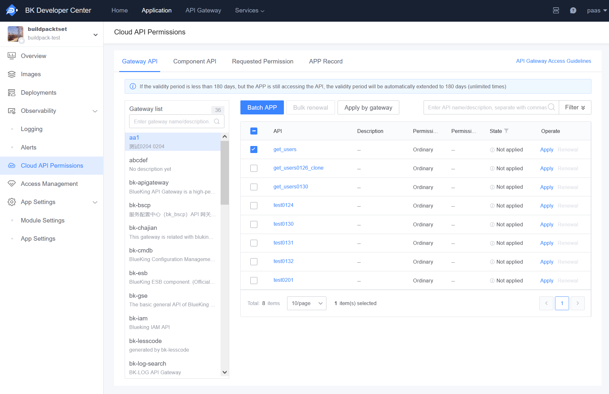
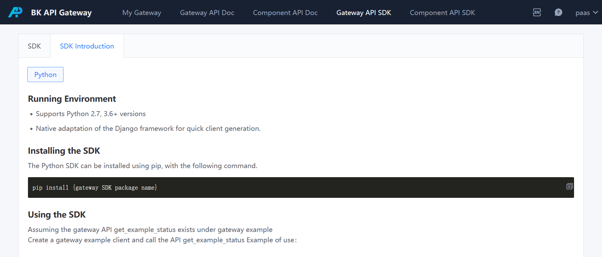

# How to Invoke BlueKing Cloud API

You can access the APIs of various services on the BlueKing platform and the APIs provided by BlueKing SaaS applications through the BlueKing Cloud API.

## Apply for API Invocation Permissions

To access the BlueKing Cloud API, you must apply for invocation permissions.

In the Developer Center application page, click on the Cloud API Permissions in the left menu to enter the Cloud API Permissions Management page, and switch to the Gateway API page.

In the gateway list, filter out the gateway for which you want to apply for permissions, click on the gateway name, and then select the gateway APIs you need to access on the right page and click on Batch Apply.

In the application record, you can view the details of the application form. Once the permissions are approved, you can access the gateway API.

> Tip: APIs that do not require permission application have default permissions and do not need to be applied for.

- After approval by the administrator, you can view the ownership permissions of the resources.

> Tip: At this stage, after applying for API permissions, you will have 180 days of access rights; moreover, to facilitate the user's continuous use, if there is access within half a year, it will be automatically renewed for another six months; otherwise, an email will notify the BlueKing application developer to manually renew.

## API Invocation

In 'API Gateway' - 'Gateway API SDK', on the SDK list page, you can search for the gateway's SDK. If the gateway does not provide an SDK, you can contact the gateway administrator to generate a gateway SDK.

On the SDK description page, you can view how to use the gateway SDK.

Note: The SDK needs to be used in conjunction with the `BK_API_URL_TMPL` environment variable to function normally. When deploying applications to the Developer Center, this environment variable will be automatically injected. During local development, you need to manually set this environment variable, and the value can be obtained from the 'View Built-in Environment Variables' in the Developer Center's 'Module Configuration' - 'Environment Variables' (for regular applications: 'APP Engine' - 'Environment Configs') page.