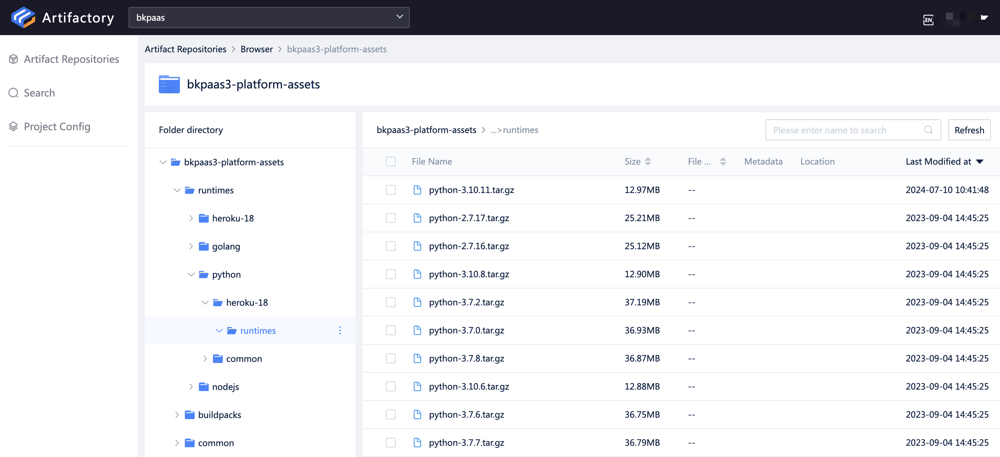

# Custom Python Versions

Currently, all newly created applications in the BlueKing Developer Center default to **Python 3.10**. If you want to switch to another Python version, please refer to the instructions below.

To change the Python version, developers need to add a `runtime.txt` file in the application build directory (defaulting to the root directory if not set) and specify the custom version number in it. The platform will select the Python version based on this number, for example:

```bash
# runtime.txt

python-3.6.12
```

Then commit it to the **Code Repository**, and after deployment, you can use Python 3.6.12. Enjoy!

## Currently Supported Python Versions

The following is a list of versions supported by the community version by default:

```
python-2.7.18
python-3.6.8
python-3.6.12
python-3.10.5
```

## Python Multi-version Maintenance

Platform administrators can view all supported Python versions in the current environment in the `bkpaas3-platform-assets/runtimes/python` directory under the bkpaas project in the BlueKing Artifact Repository.

If other Python versions are needed, you can also refer to [Upload PaaS Runtimes to the Artifact Repository](https://bk.tencent.com/docs/markdown/ZH/DeploymentGuides/7.1/paas-upload-runtimes.md) to upload.

