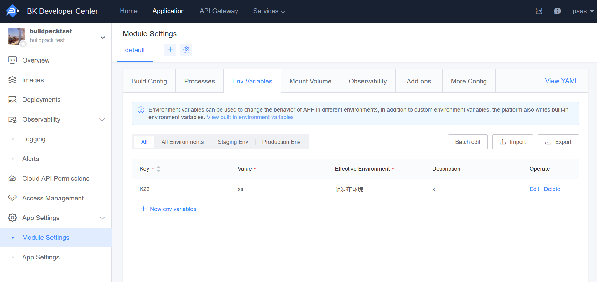

# Custom Environment Variables

## Setting Environment Variables for Applications

For better flexibility, we recommend using environment variables to manage some configuration information of your application. You can modify the values of environment variables on the application's management page.

To avoid conflicts with system variables, variable names must meet the following requirements:

- Consist of uppercase and lowercase English letters, numbers, or underscores
- The length cannot exceed 50 characters
- Cannot use the prefix of built-in environment variables of the platform

For example, `CONFIGVAR_TEST` is a valid variable name.

### How to Set Environment Variables

Entry points for operations:

- For regular applications: 'APP Engine - Env Configs'
- For cloud-native applications: 'Module Config - Environment Variables'

Environment variables can specify the environments in which they take effect (Staging Env and Production Env). Selecting all environments will apply the environment variables to all environments simultaneously.

**Note**: After adding environment variables, you need to redeploy the application for the changes to take effect.



### How to Retrieve Variable Values

In your application code, you can retrieve the values of the variables you set through any means that can access environment variables. For example, in Python:

```python
import os
os.environ.get('CONFIGVAR_TEST')
```

> Tip: After modifying the environment variable configuration, the application must be redeployed to take effect in the corresponding environment.

## Platform Reserved Environment Variables

The platform reserves some environment variables for management ([Description of Built-in Environment Variables](./builtin_configvars.md)), avoiding common names to prevent conflicts. Therefore, the platform reserves the following environment variables:

- SLUG_URL
- HOME
- S3CMD_CONF
- HOSTNAME

Or environment variables with the following prefixes:

- IEOD_
- BK_
- BKPAAS_
- KUBERNETES_