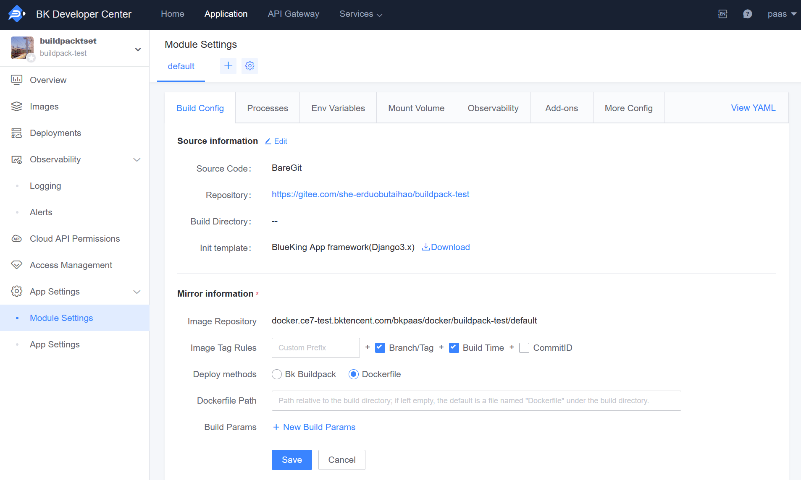
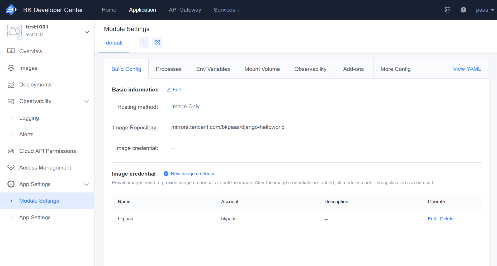

# Application Deployment Process

## How to Deploy a Django Application

First, let's analyze how a classic Django application should be deployed:

1. Pull the code:

```
git clone --branch release http://my.project.git
```

2. Install the appropriate Python runtime:

```
sudo apt-get install python3.6
```

3. Install third-party dependencies:

```
pip install -r requirements.txt
```

4. Perform database migrations:

```
python manage.py migrate
```

5. Collect static files:

```
python manage.py collectstatic --noinput
```

6. Start the service:

```
gunicorn wsgi -w 4 -b :5000
```

As you can see, deploying a complete application often requires multiple steps, each of which takes several seconds or even minutes. This is just the deployment time for one instance, and the time consumption of deploying multiple instances can have a significant impact on the business.

Moreover, if the project has customized requirements, such as using a specific version of the Python distribution or using pipenv instead of pip for dependency management, these requirements can completely change the deployment process and inevitably involve users.

So how does the BlueKing PaaS platform solve these deployment problems and help applications with containerized deployment?

## BlueKing Application Deployment Process

BlueKing PaaS divides application deployment into two phases: build and deployment:

1. Continuous Integration (CI): Cloud-native applications support the following three build methods:

- BlueKing Buildpack
- Dockerfile
- Directly provide an image repository

Note: Images built using Buildpack and Dockerfile will be pushed to the **private repository** in the Developer Center, and you can view the image details on the 'Image Management' page of the cloud-native application.

2. Continuous Deployment (CD): Create new containers to quickly start the corresponding services, and provide multiple features such as automatic scaling, volume mounting, and custom domain name resolution.

By merging the complex and time-consuming multiple build tasks into the build phase, the repeated build work when deploying multiple instances is avoided, making it possible to quickly start services during actual deployment.

## BlueKing Buildpack Build

The BlueKing PaaS platform uses a framework compatible with the [heroku buildpack api](https://devcenter.heroku.com/articles/buildpack-api) to drive different types of build tools.

> What is a build tool? A build tool is a set of scripts that convert code into a specific runtime environment, generally related to a certain programming language, responsible for dependency installation, compilation, or runtime installation, etc.

The build tool will detect whether the project needs to be built, generally based on the feature file. For example, for a classic Python application, assuming the application uses pip to manage dependencies, the project structure should be as follows:

```
.
├── demo
├── requirements.txt
└── setup.py
```

At this point, the build tool will recognize the requirements.txt in the build directory (default to the root directory if not set), and call `pip install -r requirements.txt` to install dependencies.

Additionally, if the application uses pipenv to manage dependencies, the project structure should be as follows:

```
.
├── Pipfile
├── Pipfile.lock
├── demo
└── setup.py
```

The build tool will recognize the Pipfile in the build directory (default to the root directory if not set) and call `pipenv install` to install dependencies.

**Note**: If both `Pipfile` and `requirements.txt` files are present in the project directory, the `Pipfile` will be used.

The build tool presets common build solutions for corresponding technology stacks, and as long as the project meets the standard specifications, it can automatically perform runtime builds. At the same time, the build tool also provides some hooks to help users handle irregular projects or add custom build operations:

- bin/pre-compile: Called before the build, it can modify the project structure;
- bin/post-compile: Called after the build, it can perform static file collection or database change operations;

Hooks need to be placed in the project's bin directory and are formatted as executable script commands.

### Composite Project Build

The build tool provides build solutions for specific runtime environments, and through the cooperation of multiple build tools, composite projects can be built. Multiple build tools will be called one by one according to the loading order, and finally, a complete runtime environment will be built.

Assuming a Django application needs to use webpack to package Vue, the directory structure is as follows:

```
.
├── backend
│   ├── __init__.py
│   └── views.py
├── frontend
│   └── App.vue
├── package.json
├── requirements.txt
└── manage.py
```

It can be seen that this project uses two languages for development, backend is a backend application developed using Python, and frontend is a Vue front-end application.

For such composite projects, Node.js and Python build tools can be loaded and built simultaneously:

- The Node.js build tool installs the Node runtime based on package.json and executes npm run build to build static files;
- The Python build tool installs the Python runtime based on requirements.txt and executes pip install -r requirements.txt to install dependencies;

**Note:**

- [Build(Build) phase hooks](../paas/build_hooks.md) will be triggered after each build tool is executed.

## Dockerfile Build

Added Dockerfile build, supporting users to customize the build process and complete the build of application code for various programming languages.

You can set the Dockerfile path and build parameters in 'Module Configuration' - 'Build Configuration' - Image Information.



## Directly Provide Image Repository

In addition to source-based deployment methods, the BlueKing PaaS platform also supports deploying applications using Docker images, which can solve some problems such as difficult-to-install dependencies and slow builds.

If it is a private image, you need to add image credentials in 'Module Configuration' - 'Build Configuration' and configure them in the basic information of the image.



### How to Build x86 Platform Images Using Machines with Arm Architecture

Docker supports building cross-platform images through the buildx tool, for details please refer to the [official documentation](https://docs.docker.com/desktop/multi-arch/#multi-arch-support-on-docker-desktop).

```bash
docker buildx create --use
docker buildx inspect --bootstrap
# Here we must push at the same time during the build phase, because multi-platform builds are only saved in the build cache
docker buildx build --platform linux/amd64,linux/arm64 -t ${your image tag} --push .
```

## Summary

This article is just a simple principle analysis of the BlueKing application build and deployment process, and the listed commands cannot fully represent the real work of the build tool. In fact, a build tool is not just some automated scripts, but also depends on the source, different versions of the runtime environment, and the cooperation of peripheral tools. Thanks to the build tool, BlueKing applications only need to maintain standard project specifications, without worrying about specific deployment details, achieving the effect of one-time build, multiple deployments.