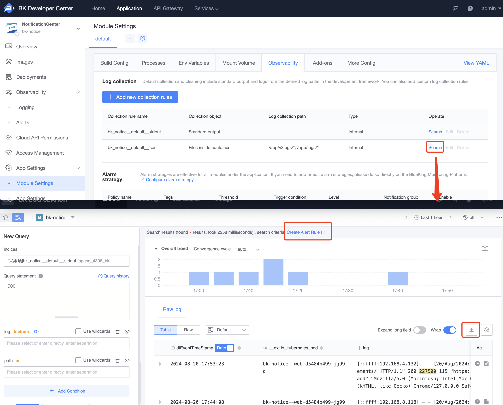

# Introduction to Advanced Logging Features

The Developer Center now supports the collection of application logs through the BlueKing Logging Platform. With this powerful platform, developers can utilize a variety of advanced features to manage and analyze log data. These features include advanced log keyword search, advanced alert settings, log downloads, etc., greatly enhancing the flexibility and efficiency of log management.

## Main Features

### 1. Advanced Log Keyword Search

On the 'Module Configuration' - 'Observability' - 'Log Collection' page, you can directly use the 'Search' function to jump to the corresponding BlueKing application namespace on the BlueKing Logging Platform to perform advanced log keyword searches, and configure log keyword alerts based on the search content.

### 2. Log Download

Developers can directly download the required log files on the 'Search' page of the BlueKing Logging Platform for offline analysis or archiving.

### 3. Custom Reporting

On the 'Management' - 'Custom Reporting' page of the BlueKing Logging Platform, developers can add new log collection rules and modify log cleaning rules.