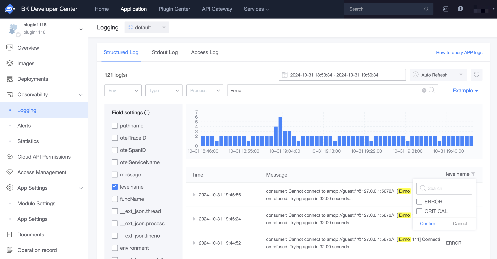

# Overview of Logging Service

## Introduction

Logging is one of the core functionalities in application development, and the BlueKing Developer Center provides a powerful logging query service for application developers.

After developers report logs in their applications, they can search for logs on the 'Log Query' page using various conditions.

Applications developed using the development framework will have preset logging configurations. As long as you follow the guidelines in the development framework documentation and use the correct logging output statements, you will be able to view logs in the Developer Center once the application is deployed to the `PaaS` platform.

## How to Report Application Logs

### Python Development Framework

The BlueKing development framework provides default logging configurations, which can be used directly by enabled applications.

Log Format:

- Local development: Logs are output in plain text format by default.
- Deployed to staging/pre-production or production environments: Logs are automatically output in `JSON` format, with one log per line, and different `loggers` correspond to different log files.

Log Level:

- Local development: The default log level is `DEBUG`.
- Deployed to staging/pre-production or production environments: The default log level is `ERROR`.

After logs are written to a file, the collection process will collect, parse, and enter them into the engine in real-time. Subsequently, you can query application logs through the engine on the frontend.

#### Example

Taking the staging environment of the `blueapps` application as an example, the development framework predefines four `loggers`:

| Logger    | Remarks              |
| --------- | ----------------- |
| root      | Application Logs          |
| celery    | Celery Logs       |
| gunicorn  | Gunicorn Access Logs |
| component | Component Logs          |
| mysql     | MySQL Logs        |

Developers only need to focus on `root`/`celery`:

- Application Logs

```python
from django.http import HttpResponse
import logging

logger = logging.getLogger('root')

def hello(request):
    logger.info("hello world")

    try:
        1 / 0
    except:
        logger.exception("an exception, the error trace stack will be sent too")

    logger.error("an error, no trace stack")
    return HttpResponse("hello world")

```

- `celery` Logs

When printing logs for asynchronous tasks and scheduled tasks implemented through `celery`, you need to use `celery`.

> Tip: The `logger` here is `celery`. If chosen incorrectly, logs will be output to the wrong file, which may result in not being able to find them.

```python
import logging
from celery import shared_task

logger = logging.getLogger('celery')

@shared_task
def async_hello():
    logger.info("hello world")
```

## How to Query Application Logs

### Structured Logs

Entry Points:

- Cloud Native Applications: 'Observability' - 'Log Query' - 'Structured Logs'
- Regular Applications: 'APP Engine' - 'Log Query' - 'Structured Logs'

Logs output to files during local development, when deployed to staging/pre-production or production environments, the collection process will collect and parse the logs into Json format before entering them into the engine. These logs are referred to as structured logs.



Log queries need to follow two steps:

1. Determine the time range for the query.
2. Filter by query conditions (or keywords).

It is particularly important to note that **the time range will determine the specific options for query conditions**.

For example, if all logs during time period X come from the prod environment, then under the 'Deployment Environment' condition, you can only choose prod.

Currently, there are three fixed conditions available for selection: 'Deployment Environment', 'Log Output Stream', and 'Application Process'. For other conditions, you can refer to [Log Query Syntax](./log_query_syntax.md) to customize query conditions.

### Standard Output Logs

Entry: 'APP Engine' - 'Log Query' - 'Standard Output Logs'

Logs that are directly output to standard output (stdout or stderr) by the application will also be collected, but the fields will not be parsed.

> Tip: Currently, the Elasticsearch cluster is being expanded, causing instability in the cluster. To avoid putting too much query pressure on the backend, querying of standard output logs is temporarily limited to the last hour. This restriction will be lifted later.