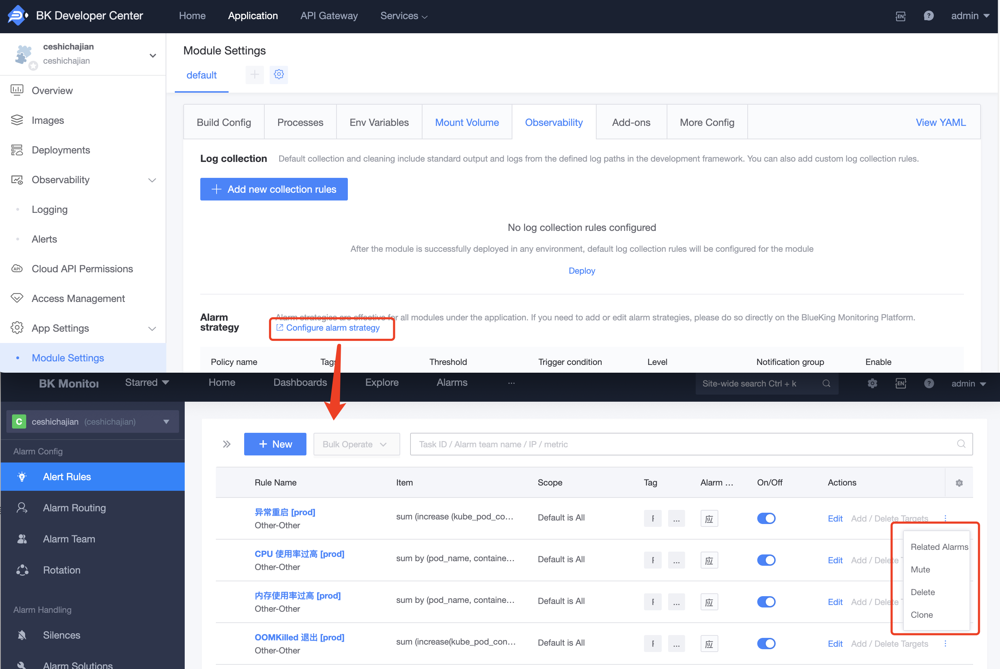

### Introduction to Monitoring and Alerts

The Developer Center of the BlueKing PaaS platform has achieved seamless integration with the BlueKing Monitoring platform, providing developers with powerful monitoring and alerting capabilities. After an application is deployed, the system automatically creates a corresponding BlueKing application namespace on BlueKing Monitoring and automatically opens up permissions for application developers, configuring default alert policies. This allows developers to more easily manage the running status of applications and respond to potential issues in a timely manner.

On the 'Observability' - 'Alert Records' page, developers can conveniently view all alert records for the application, helping to quickly locate and resolve issues.

### Monitoring and Alerting Features

On the BlueKing Monitoring platform, developers can directly operate the following monitoring and alerting related functions and add more alert policies as needed:

- **Modify Alert Thresholds**: Adjust the thresholds for triggering alerts flexibly according to the actual running conditions of the application, to meet different business needs.

- **Modify Notification Groups**: By default, the notification group is set to the application developers. Developers can modify the notification group according to team needs to ensure that relevant personnel can receive alert information in a timely manner.

- **Mute Alerts**: In some cases, developers can choose to mute specific alerts to avoid false positives caused by temporary factors and ensure that focus is on critical issues.

Through these features, the BlueKing Monitoring platform provides developers with comprehensive monitoring and alert management capabilities, helping teams to more efficiently operate applications and improve the stability and reliability of the business.