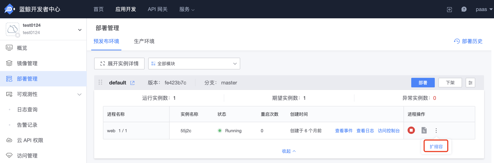

# Application Processes

## What is an Application Process?

An application process is a collection of computing units that can be composed of one or more **identical** computing units.

Each computing unit is equivalent to a Docker container that can execute commands specified by the developer.

### Characteristics of Application Processes

Because it has multiple computing units, the **application process** has many cool features:

- Fully manageable by developers. Control the start and stop of processes and view real-time logs in 'APP Engine - Process Management'.
- Load balancing. When the number of computing units is greater than 1, the requests of the process will be evenly distributed to each unit.
- Disaster recovery and self-recovery. Multiple computing units run independently, and the crash of one unit does not affect other units and will be attempted to be restarted.
- Scalable resources. The platform provides a variety of process resource plans that can be easily scaled up or down.

### Advantages of Using Application Processes

You can split a more complex system into multiple application processes, just like multiple processes you start locally, each responsible for different parts of the system.

For example, there is a BlueKing application called `blueapps` with a Celery background periodic task, which you can split into three application processes: Web, Worker, and Beat.

Compared to the original "unified" BlueKing application, such a split has obvious advantages:

- **Processes can be started and stopped independently**. For example, when you don't need the Beat or Worker process, you can directly stop it on the 'APP Engine - Process Management' page, without affecting the Web process at all.
- **Developers can freely modify the startup method of each process**. For example, when you encounter a concurrency bottleneck, you can manually adjust the parameters to make Gunicorn start more processes and expand the service capacity.

In general, application processes give the application certain microservices capabilities, meeting the needs of multiple components of the application while maintaining a unified management entry.

Speaking of this, you must be full of curiosity, so how do you define and create these application processes?

## How to Define Application Processes

app_desc.yaml is the configuration file used by the BlueKing PaaS platform to describe BlueKing applications. The latest version of the development framework has adopted app_desc.yaml to define processes.

Let's see how to define processes in the app_desc.yaml file:

```yaml
module:
  language: Python
  processes:
    web:
      command: gunicorn wsgi -b :$PORT --log-file -
```

For more configuration information about app_desc.yaml, refer to: [APP Description File](./app_desc.md).

### [Not Recommended] Procfile

Some existing applications use Procfile to define processes. Procfile, or Process File, as the name suggests, is the file entry used to define application processes.

Let's take a look at an example of `blueapps`'s Procfile:

```yaml
web: gunicorn wsgi - b :$PORT --log-file -
```

It is a yaml file, where `web` is the identifier of the process, that is, `process_type`. The following are all specific process commands, that is, a line of executable bash commands.

**Note**:

- When the application has both `app_desc.yaml` and `Procfile` files at the same time, the configuration in the `Procfile` file shall prevail.
- For consistency, it is recommended to use `app into yaml` to define processes uniformly.

## Create a New Application Process

Still using the `blueapps` application, suppose that the requirements have become more complex and a simple Web is no longer sufficient, you need to add Celery to complete background tasks.

Creating a new application process is very simple, you can add the following content to app_desc.yaml:

```yaml
module:
  language: Python
  processes:
    web:
      command: gunicorn wsgi -b :$PORT --log-file -
    worker:
      command: python manage.py celery worker -l info
    beat:
      command: python manage.py celery beat -l info
```

Or add to the end of the Procfile content:

```yaml
worker: python manage.py celery worker -l info
beat: python manage.py celery beat -l info
```

Here we use is

Very importantly, for the same BlueKing application, `process_type` is the unique identifier of this process, and there cannot be processes with the same `process_type`.

> Note: process_type can only be letters, numbers, hyphens (-), and it is recommended to use all lowercase letters.

After adding, submit the code and go to the 'APP Engine - Deployment Management' page to deploy once, see [How to Publish Deployment](./deploy_intro.md) for more information.

After successful deployment, go back to 'APP Engine - Process Management', and the "brand new" `celery` and `beat` processes should appear in the process list.

### Delete Process

Deleting a process is very easy, just like the above addition operation, you only need to delete the corresponding line in the Procfile or app_desc.yaml, and then resubmit & deploy.

## Scaling Processes

As the application's traffic or task volume gradually increases, you will find that the original process can no longer handle more loads, and then you will think of scaling processes.

In the BlueKing Developer Center, we provide a simple scaling method.

Operation entry:

- Cloud Native Applications: 'Deployment Management' - 'Expand Instance Details'
- General Applications: 'APP Engine' - 'Process Management'



> Note: Please note that process adjustment indicates your expectations for the process. If you stop a certain process, it will not be automatically started after redeployment.

## Special Web Process

You must have noticed that we always mention the web process. Because for any application, you definitely need an entrance to access it, and the web process is responsible for providing external access.

### The Meaning of Web

The platform will read all processes defined in the Procfile or app_desc.yaml, and the process with `process_type` value of `web` will be set as the application's "main access entrance" by default, providing external access capabilities.

The platform will provide the function of customizing the "main access entrance" corresponding process in the next version, please look forward to it.