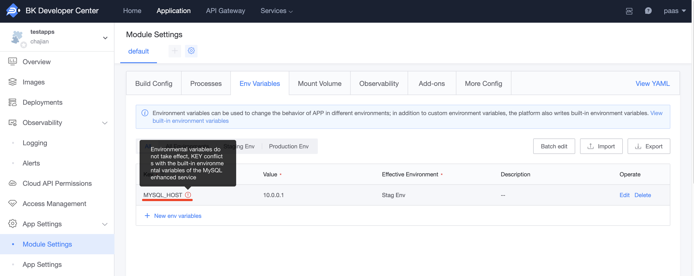
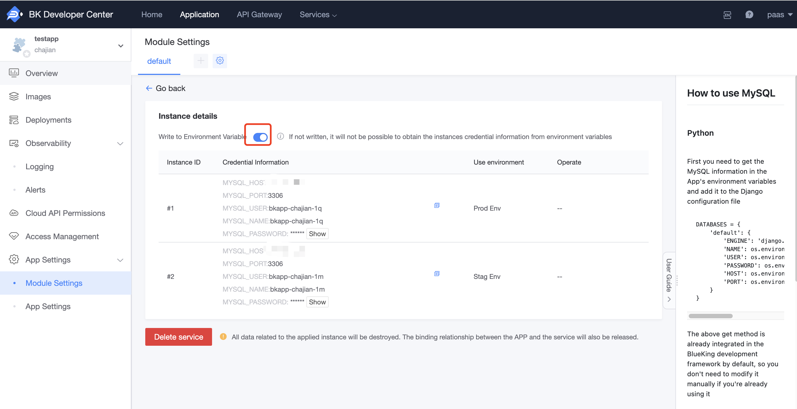

# How to Modify Add-on Environment Variables

After enabling an add-on, its configuration information will be written into the application's environment variables. The built-in environment variables written by the add-on have the highest priority, so manually modifying the add-on's configuration information in the environment variable settings will not take effect.

If you want to override the built-in environment variables written by the add-on, you can follow these steps:

#### 1. Disable Writing of Add-on Environment Variables

Entry point for operation:

- Cloud Native Applications: 'Module Configuration' - 'Add-ons' - Instance Details
- Regular Applications: 'Add-ons' - Instance Details

**Note**: After disabling this option, the add-on will no longer write related environment variables to the staging and production environments. Please note that you need to redeploy the corresponding environment for the changes to take effect.

#### 2. Manually Write the Add-on's Configuration Information into Environment Variables

Entry point for operation:

- Cloud Native Applications: 'Module Configuration' - 'Environment Variables'
- Regular Applications: 'APP Engine' - 'Env Configs'

**Note**: If the configuration information in the production and staging environments is inconsistent, please add the required environment variables to each environment separately.

By following these steps, you will be able to successfully override the built-in environment variables written by the add-on and configure the application environment as needed.