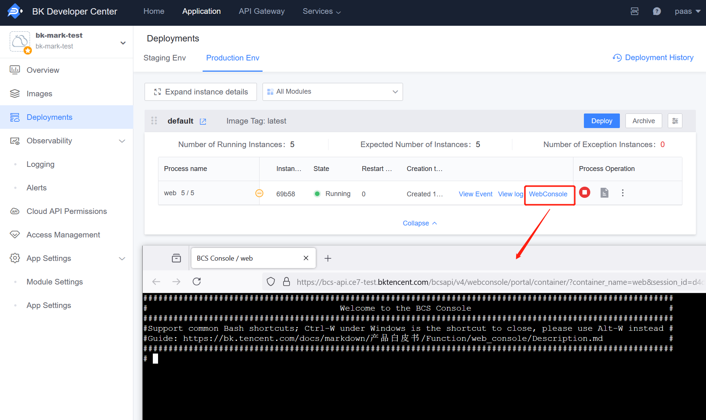

# Access Console

### What is the Access Console?

The Access Console is based on the Webconsole feature of the BlueKing Container Service, allowing users to enter the container where the process is located through the console.

Function Entry:

- Cloud Native Applications: 'Deployment Management' - Expand Instance Details - Access Console
- Regular Applications: 'APP Engine' - 'Processes' - Access Console

### What Can the Access Console Do?

By accessing the console, you can enter the container of the application process and achieve functions including but not limited to:

- View online running code

- Online debugging, such as Django applications can be debugged via `python manage.py shell`

- Execute one-off commands, such as `python manage.py <command> [options]`, etc.