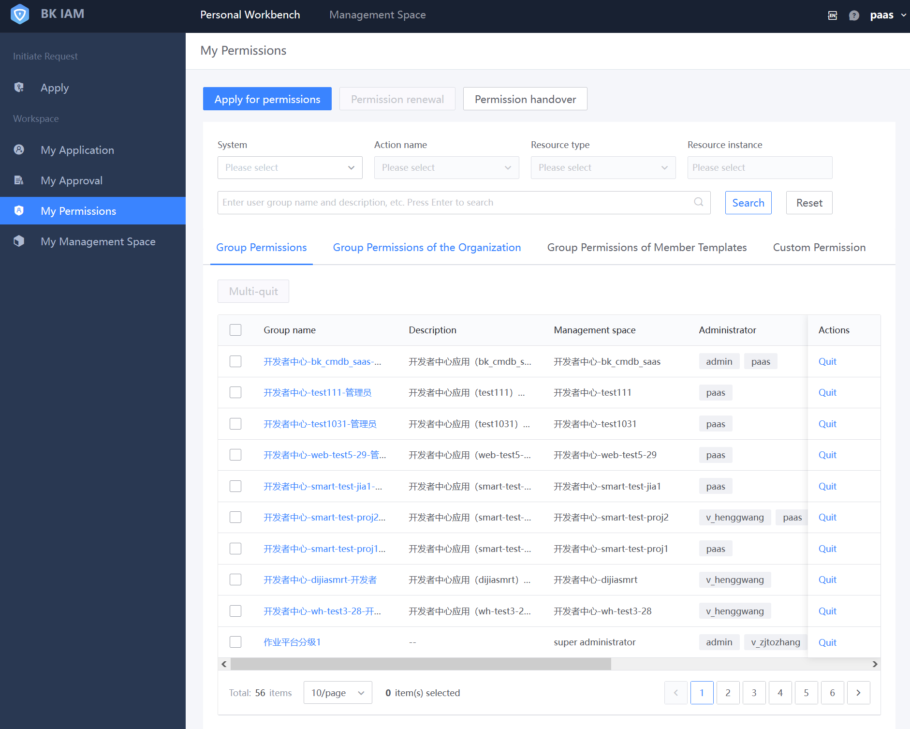

# Identity and Access Management Center

The Identity and Access Management (IAM) Center is a centralized permission management service provided by BlueKing Intelligent Cloud. It is used for the centralized integration of permissions across various platforms and SaaS within the BlueKing ecosystem, as well as for providing granular resource access control down to specific resource instances.

For detailed information on using this product, see the "[BlueKing Product System IAM Center White Paper](../../../../IAM/1.12/UserGuide/Introduce/README.md)."