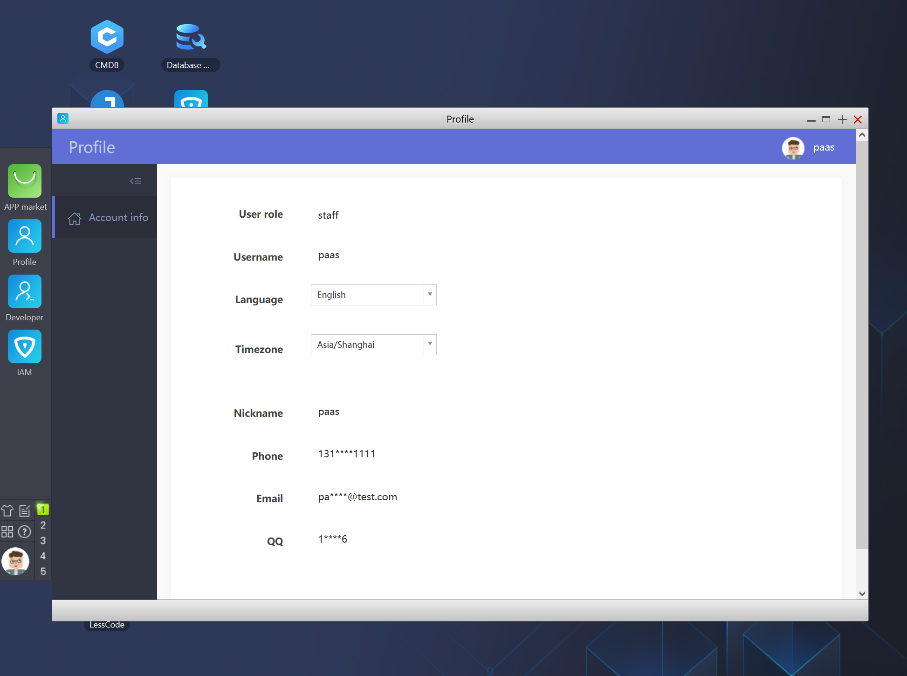

# Personal Center

The "Personal Center" provides basic functions such as personal information and password modification. More feature menus are displayed based on different user permissions, with basic permission control implemented.

- **Administrator**

  "User Management": Perform user addition, deletion, modification, and inquiry
  
  "API Application": Approve API application documents and view "Historical Approval" documents

- **Regular User**

  Limited to personal information. If notification channels such as WeChat are configured on the PaaS platform, it is possible to "Bind WeChat" to receive WeChat messages.