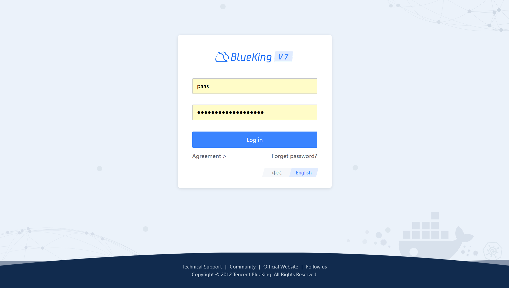
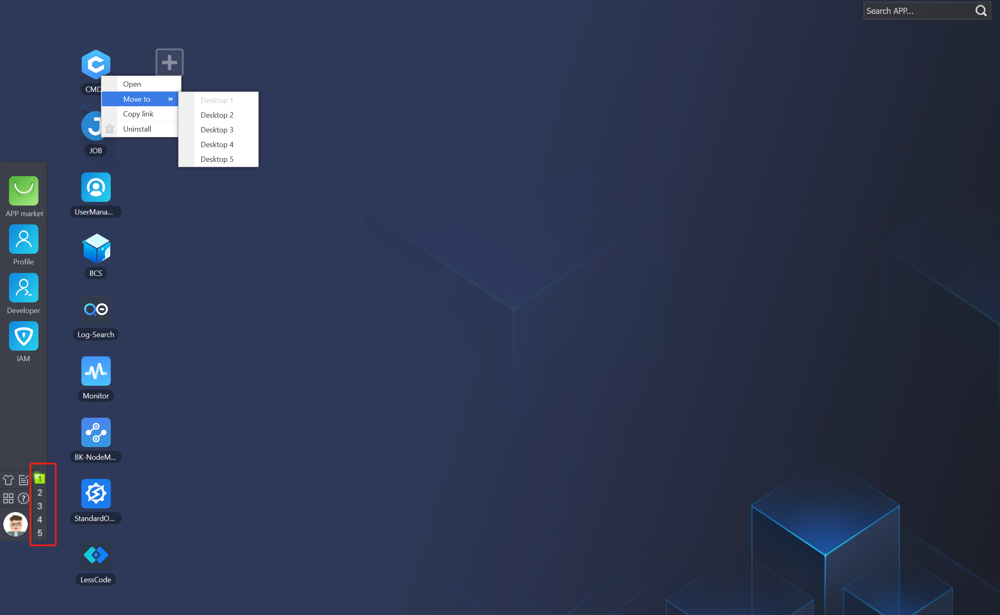
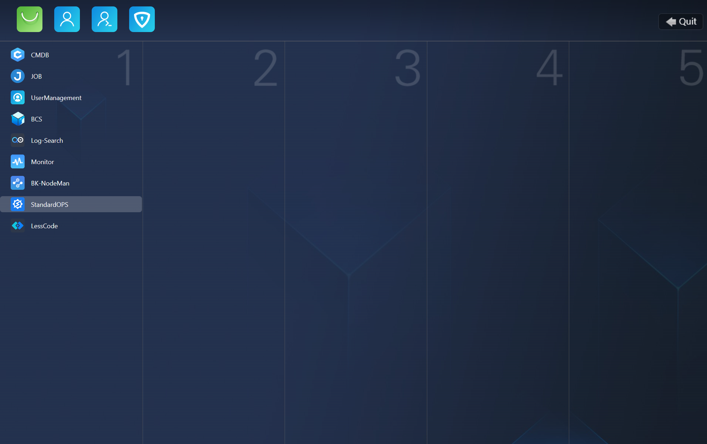
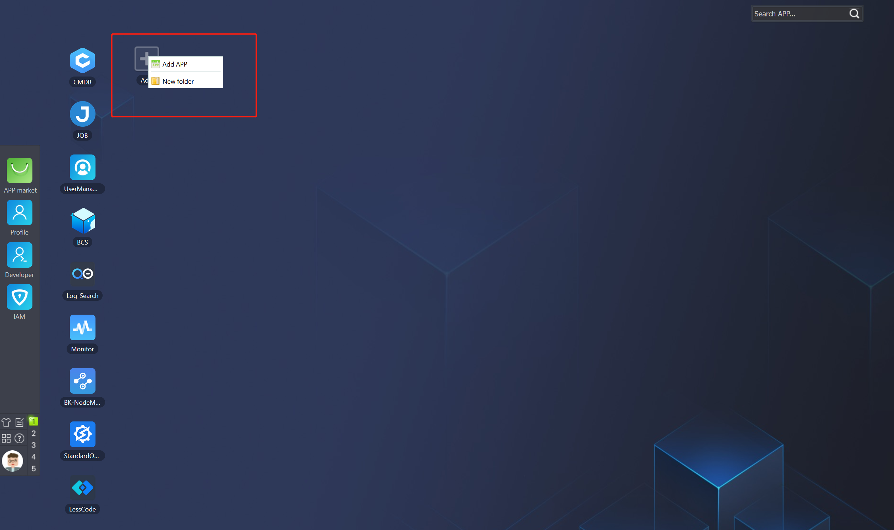
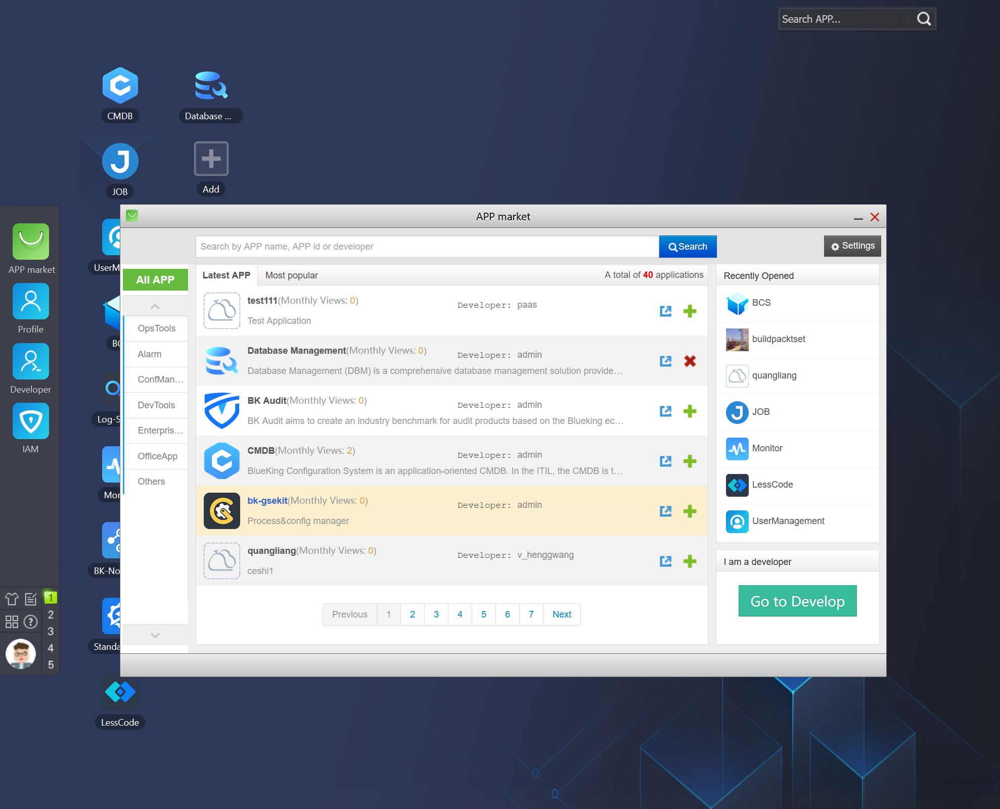
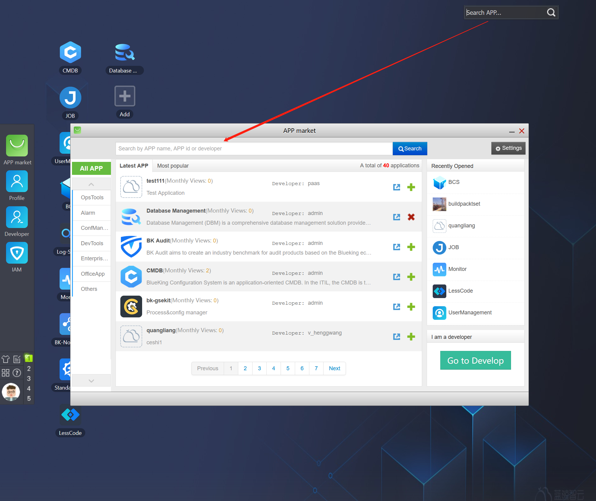

# Personal Workspace

BlueKing provides many out-of-the-box SaaS products, which are uniformly displayed in the user's "Personal Workspace," also known as the "Desktop."

On the login screen, there are quick access entries such as "View User Agreement," "Forgot Password," and "Switch between Chinese and English."

## Multi-Desktop Mode

By default, there are 5 desktops provided, which can be used to store items according to personal needs. Clicking on the floral icon allows you to quickly enter the global view of the 5 desktops, and dragging icons can complete the adjustment of SaaS between different desktops.

In addition, there are functional entries for "Change Skin," "Quick Guide," and "Feedback."

## Adding Operations

After clicking "Add," you will see options for "Add Application" or "Create Folder." "Folders" are mainly used to categorize SaaS on the desktop.

"Add Application" will open the "Marketplace," where you can select and add the desired application.

Right-clicking on the SaaS logo allows you to "uninstall" that SaaS from the desktop.

## Search Operations

The search function is mainly aimed at the SaaS applications in the "Marketplace," helping users quickly find and view detailed information about the SaaS through the marketplace.

