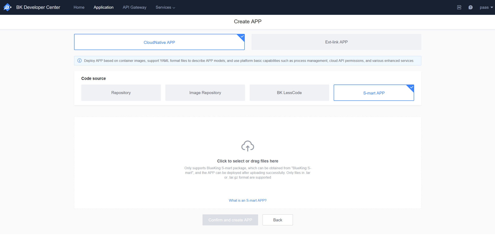
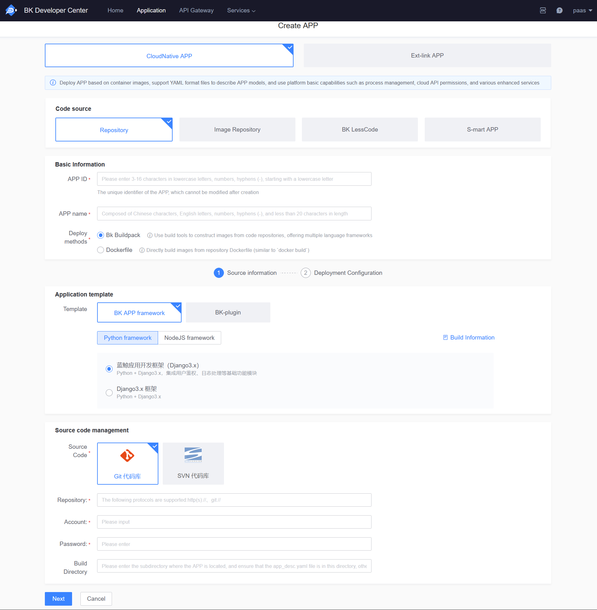
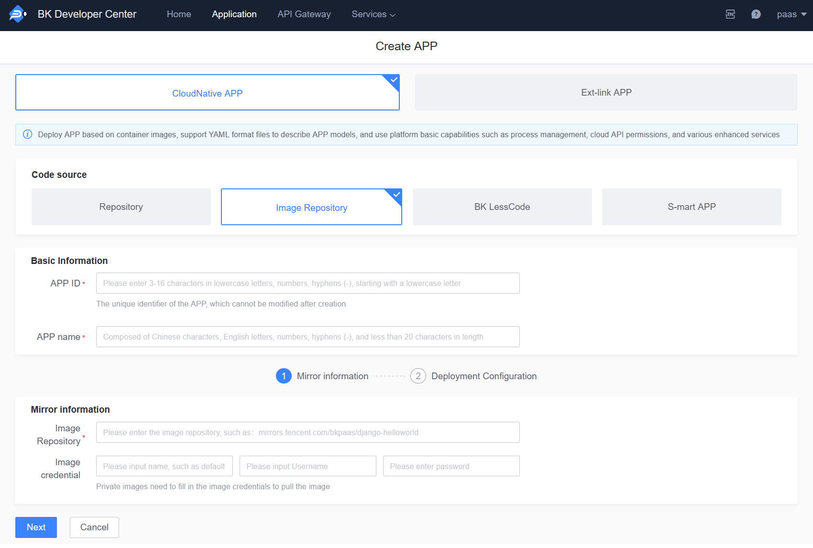
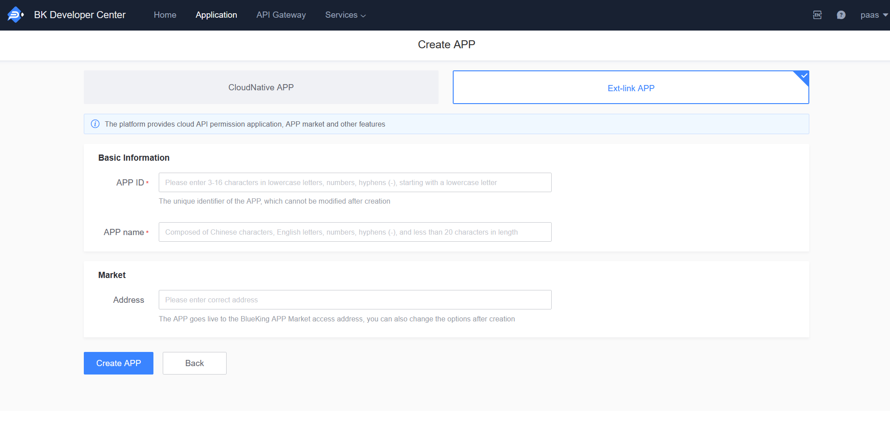

# Application Management

The BlueKing PaaS platform hosts numerous SaaS applications, which are categorized based on their deployment methods as follows:

### First Type: S-mart Applications

S-mart applications are used by following the steps: "Download SaaS package -> Upload to create an application -> Deploy (to the production environment) -> Configure a standalone domain (optional) -> Access via the Workbench."

### Second Type: Applications Developed Based on Code Repositories

SaaS applications developed by developers/users themselves, with code hosted in a code repository. The development process follows the steps: "Create application -> Develop -> Deploy to staging environment -> Deploy to production environment."

### Third Type: Applications Deployed via Images

Developers can use pre-built images to deploy directly in the Developer Center.

### Fourth Type: BlueKing Operations Development Platform Applications

Applications for the BlueKing Operations Development Platform can be deployed in the Developer Center after generating source code packages on the BlueKing visualization platform.

### Fifth Type: Ext-Link Applications

The platform provides a marketplace feature for these applications, allowing third-party systems to be registered with the "BlueKing Application Market" and apply for cloud API permissions, but does not provide application engine-related functions. This can be used for:

1. Placing third-party systems on the BlueKing desktop/workbench for use, requiring the setup of a third-party access address.

2. Only for applying for API access permissions.

