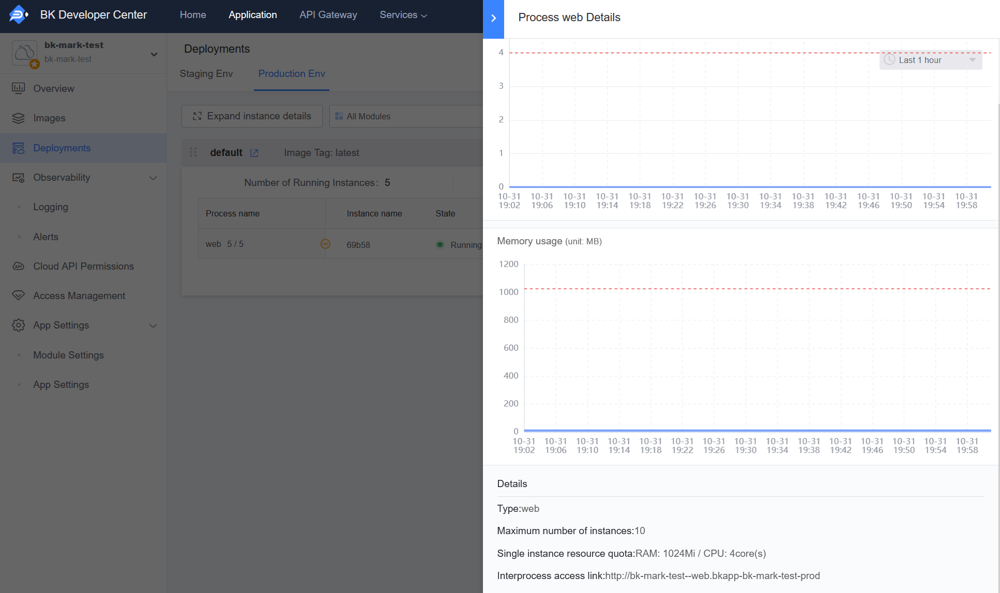

# System Maintenance

The PaaS3.0 platform provides basic maintenance methods, allowing administrators to perform simple maintenance operations through the WEB page.

Access address: `{PaaS3.0 Developer Center Access Address}/backend/admin42/`

Instructions:
1. Initially, only the `admin` account can access the management backend.
2. You must first open and log in to the PaaS3.0 Developer Center before you can normally open and access the backend management.


If you have integrated a custom login and there is no `admin` account, you can enter the `bkpaas3-apiserver-web` pod and execute the following command to add other administrator accounts:

```python
from bkpaas_auth.core.constants import ProviderType
from bkpaas_auth.models import user_id_encoder
from paasng.infras.accounts.models import UserProfile

username="your_name"
user_id = user_id_encoder.encode(ProviderType.BK.value, username)
UserProfile.objects.update_or_create(user=user_id, defaults={'role':4, 'enable_regions':'default'})
```

### User List

Add users who can access the management backend here.

Note: User type is: BK, User role is: Superuser


### Application Cluster Management

Here you can modify application cluster configurations and add new application clusters. The changes will take effect after redeploying the application.

For detailed parameter descriptions, please refer to [Initialize Cluster Configuration](../../../../Operation/PaaS3/docs/configure_initial_cluster.md).

### Application Resource Management

Developers can view the resource allocation limits for application processes in "Deployment Management" - "Process Details".



If you need to adjust the resource allocation limits for application processes, you can filter out the specific application in the management backend "Platform Management" - "Application List", enter the application's "APP Engine" - "Process Management" page, and click "Modify Resource Plan" for the corresponding process. You can:
1. Select an existing resource plan.
2. Create a new resource plan.


### Application Environment Variable Management

Developers can add and modify environment variables in "Module Configuration" - "Environment Variables", but cannot add environment variables prefixed with `BK_`, `BKPAAS_`, etc.
If there is a special need to add such environment variables, the administrator can filter out the specific application in the management backend "Platform Management" - "Application List", and enter the application's "APP Engine" - "Environment Variable Management" page to operate.


The management backend also includes runtime management, enhanced service management, and other functions, and you can view information about all applications on the application list page.