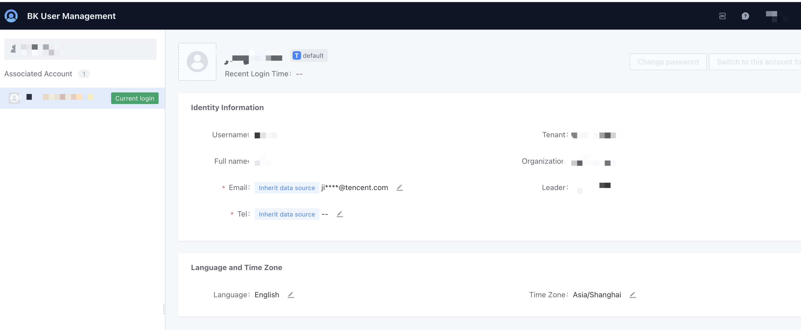

# User Management

To ensure that all users of the BlueKing products are trustworthy, the PaaS platform provides a "Unified Login" module for the entire BlueKing ecosystem, which includes a basic account system. Once the BlueKing ecosystem products are deployed, a URL will be provided for users to access.

The Community Edition offers two roles:

1. **Administrator**: Has the highest permissions, can manage BlueKing users (add, delete, modify, query), manage SaaS references, manage backend services, etc.;

2. **User**: Basic functionality usage, including: an independent personal workspace, ordinary SaaS products, and creating SaaS in the Developer Center.

> Note: The initial username for the Community Edition administrator is: admin, password: blueking. Please change it promptly. This admin is the built-in administrator account for the entire system and cannot be deleted. Please keep it safe.

Administrators can manage user information, including assigning user roles and permissions.

The following operations are supported:

(1) Add User: Enter information to add a user;

(2) Batch Import: Download Excel, fill in the information according to the format, and then batch import user information;

(3) User Search: You can choose the role type (all users, administrators, users) for searching;

(4) Operations: Edit user information, reset password, delete user.