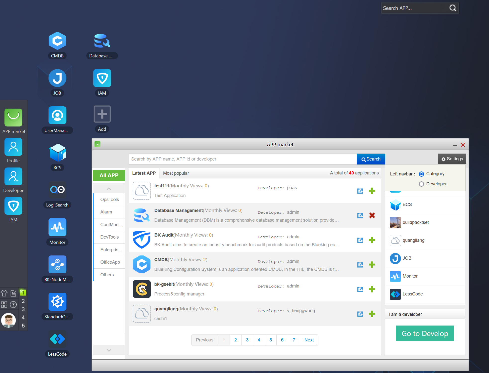

# Using a Certain SaaS of BlueKing

1. Access BlueKing's "Workspace" / "Desktop" (If prompted for incorrect username/password, please contact the system administrator to apply for permissions)

2. Click on the SaaS of interest to start using it (If you have any questions during the use of the SaaS, please contact the SaaS developer/operation person in charge)

