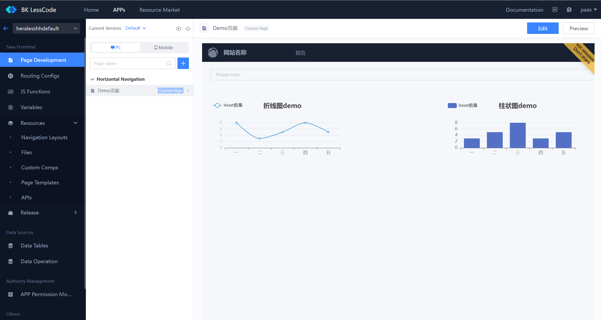
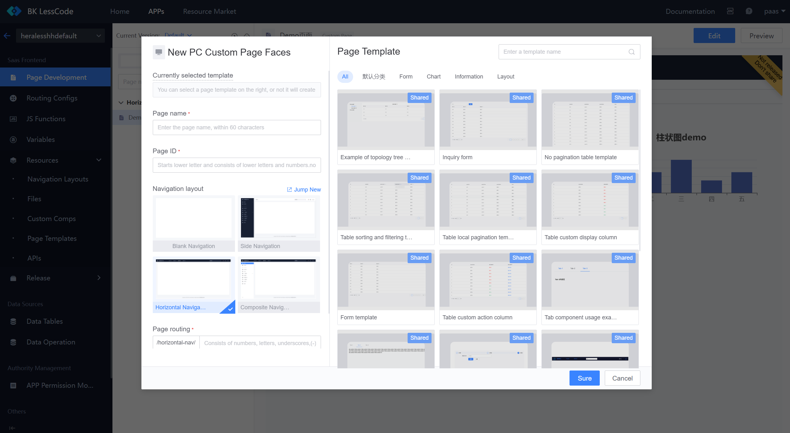

# How to Drag and Drop a Frontend Interface Using BlueKing MagicBox

1. Visit [MagicBox](http://magicbox.bk.tencent.com/)

2. Select "Visual Layout" and choose either "PC Visual Layout" or "Mobile Visual Layout"

3. Taking the PC side as an example: select the website "Layout" structure

4. Choose the required frontend elements from the left navigation and drag them into the layout on the right; double-click the elements to edit the content

5. Finally, click "Save"/"Download" above to obtain the complete frontend interface code.