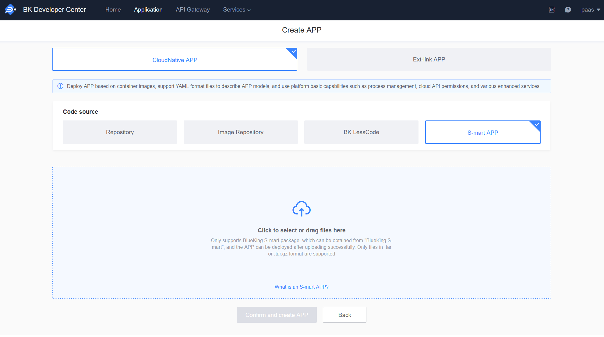
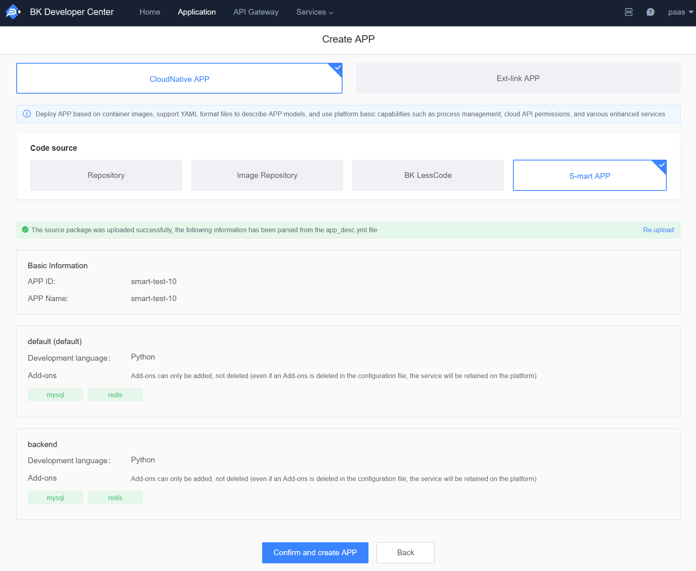
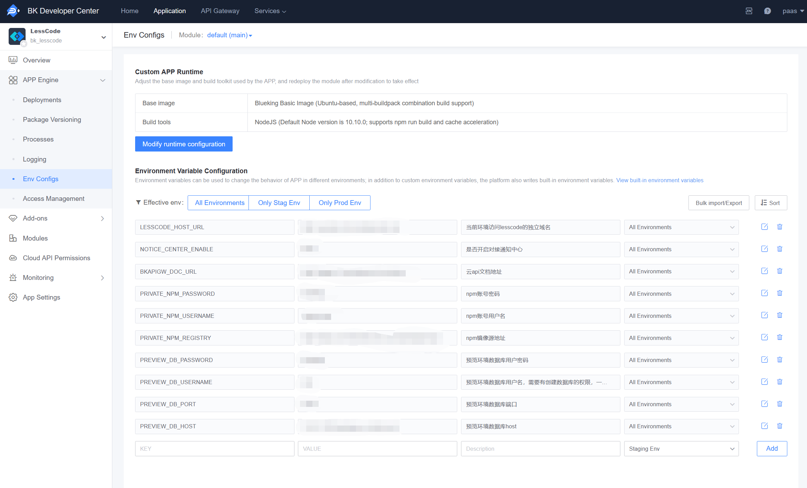

# How to Deploy the BlueKing Lesscode Development Platform

The BlueKing Lesscode Development Platform is deployed on the PaaS3.0 Developer Center as an S-mart APP, with the APP ID being: bk_lesscode.

### Create an Application

Create an application by uploading an S-Mart package.

After uploading the source code package, the application information will be parsed as follows:

Click "Confirm and Create Application" to create the application.

### Configure Environment Variables

Before deploying the application, you need to configure the environment variables that are necessary for the bk_lesscode application to run.

| Environment Variable Name | Description |
| --- | --- |
| `PRIVATE_NPM_REGISTRY` | npm mirror source address, fill in the value according to the following template: `${bkrepoConfig.endpoint}/npm/bkpaas/npm/`, where `bkrepoConfig.endpoint` is the gateway address of the bkrepo service |
| `PRIVATE_NPM_USERNAME` | npm account username, fill in the `bkrepoConfig.lesscodeUsername` configured when deploying PaaS3.0 |
| `PRIVATE_NPM_PASSWORD` | npm account password, fill in the `bkrepoConfig.lesscodePassword` configured when deploying PaaS3.0 |
| `BKAPIGW_DOC_URL` | Cloud API documentation address, fill in the value of the environment variable `APISUPPORT_FE_URL` generated when deploying the API Gateway |

In the bk_lesscode application page, click "Module Configuration" - "Environment Variables" to configure npm-related environment variables, select "All Environments" for the effective environment, and the effect after configuration is as follows:

### Configure an Independent Domain

Deploy the application on the "Deployment Management" page.

After deploying the bk_lesscode application to the staging environment and production environment, you also need to configure an independent domain for the application. Currently, bk_lesscode only supports access via an independent domain.

In the bk_lesscode application page, click "Access Management" to configure a custom access address.

Note: You need to ensure that the configured domain is correctly resolved within the corporate intranet to the `Domain Resolution Target IP` in the "IP Information".