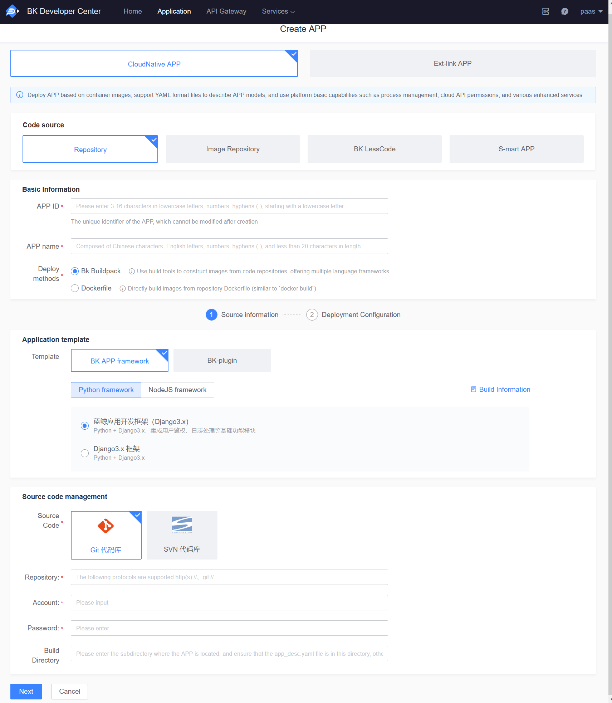

# How to Deploy SaaS from BlueKing S-mart

1. Enter "PaaS3.0 Developer Center"

2. Click "Create APP"

3. Click "S-mart APP"

4. Select the SaaS package downloaded from BlueKing S-mart

5. Click "Confirm and Create APP"

6. After the APP is successfully created, deploy it on the "Deploy" page

## Video Guide

▶️[How to Deploy S-mart APP](https://www.bilibili.com/video/BV1q341147bi/)