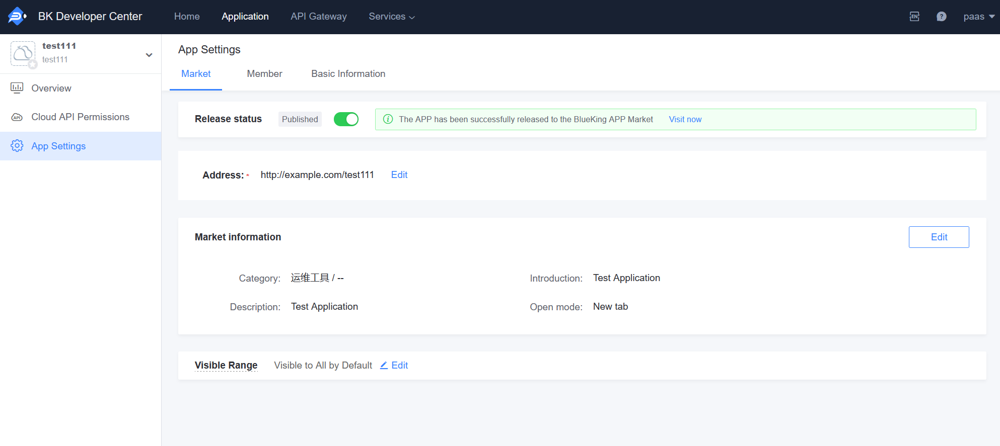

# How to Use Third-Party Systems in BlueKing Desktop/Workspace

1. Click "Create APP" -> "Ext-Link APP", and fill in the "Third-party Address"

2. In "APP Configurations" - "Marketplace", complete the APP information and publish the APP to the Marketplace

