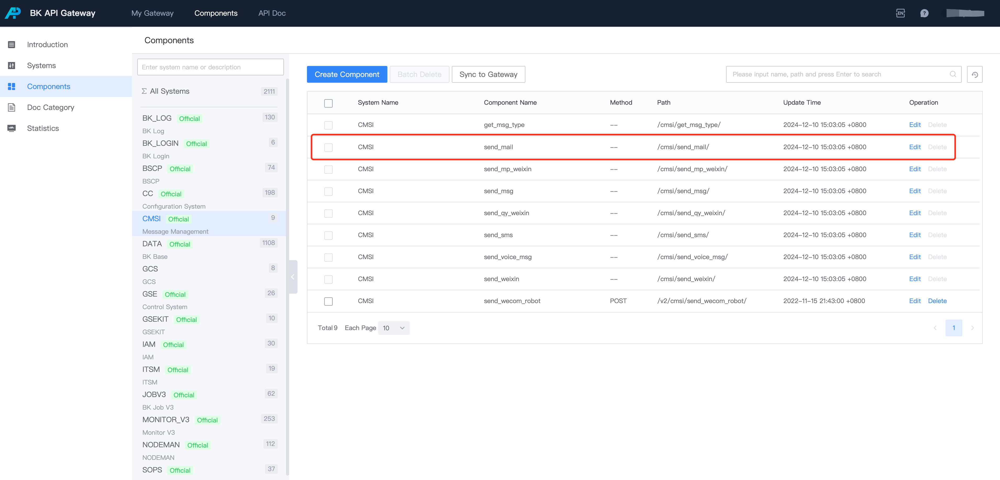
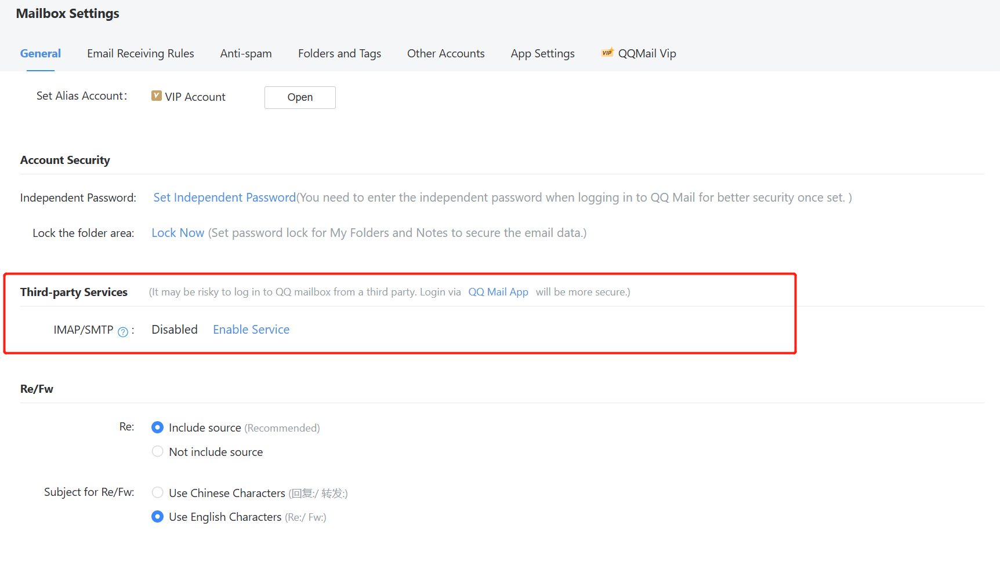
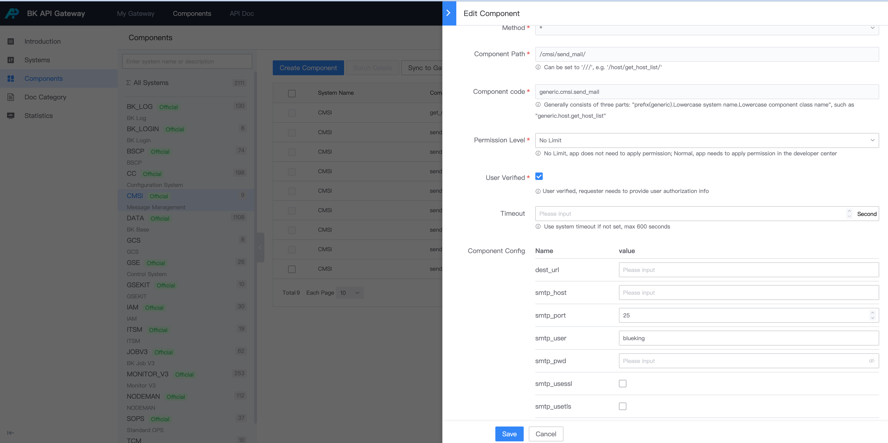

# Configure Message Notifications: Email

1. Open `http://apigw.${BKDOMAIN}/components/access`
2. Find the system: CMSI
3. Find the component: send_mail, click "Edit" on the right side.

4. Click "Edit" to edit the component configuration.

## Component Configuration

- dest_url: If the user is not proficient in Python, you can provide an interface in another language and fill it into dest_url. The ESB will only forward the request to establish the email configuration.
- smtp_host: SMTP server address (note the difference between corporate and personal email)
- smtp_port: SMTP server port (note the difference between corporate and personal email)
- smtp_user: SMTP server account
- smtp_pwd: SMTP server account password (usually an authorization code)
- smtp_usessl: Default is False
- smtp_usetls: Default is False
- mail_sender: Default email sender (same as smtp_user)

## Configuration Example

This example uses QQ Mail as an example.

### 1. Enable SMTP Service

The SMTP service of QQ Mail is disabled by default.

Log in to QQ Mail, click on "Settings" -> "Account" in the top navigation bar, find the "POP3/SMTP Service" and "IMAP/SMTP Service" items, and click "Enable".


<center>Enable Service</center>

After enabling, click "Generate Authorization Code", this authorization code will be used as `smtp_pwd`.

### 2. Configure send_mail Component

The default SMTP configuration for QQ Mail is as follows, for details refer to: https://service.mail.qq.com/cgi-bin/help?subtype=1&&id=20010&&no=1000557

```yaml
smtp_host: smtp.qq.com
smtp_port: 465
smtp_user: demo@qq.com (personal QQ email address)
smtp_pwd: Authorization Code
smtp_usessl: True
```
- Detailed configuration method is as follows:


### 3. Test the Interface

Using Postman tool as an example for the request.

- Request address:
```bash
POST http://bkapi.${BK_DOMAIN}/api/c/compapi/cmsi/send_mail/
```
- Request parameters:
```json
{
    "bk_app_code":"<replace with your bk_app_code>",
    "bk_app_secret":"<replace with your bk_app_secret>",
    "bk_username": "admin",
    "receiver": "654321@qq.com",
    "sender": "123456@qq.com",
    "title": "This is a Test",
    "content": "<html>Welcome to Blueking</html>"
}
```
Note that the sender must be consistent with the smtp_user configured in the pipeline.


### 4. Troubleshoot Interface Issues

1. Find the bk-esb Pod and observe its abnormal logs
```bash
kubectl logs -n blueking -f bk-apigateway-bk-esb-xxxx
```
2. Please check if the port is open
  - Open inbound traffic on port 465


## Video Guide

▶️[How to Configure Email Message Pipeline](https://www.bilibili.com/video/BV1NS4y1q7aT/)