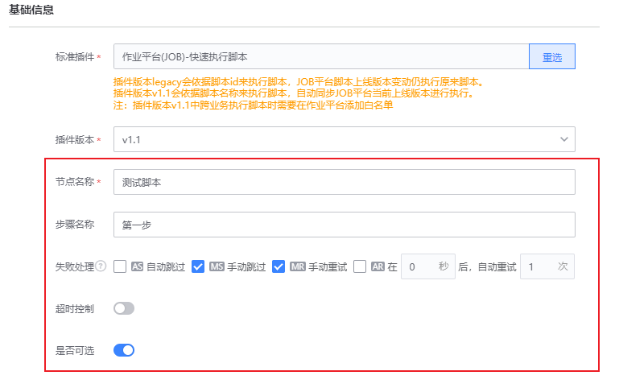
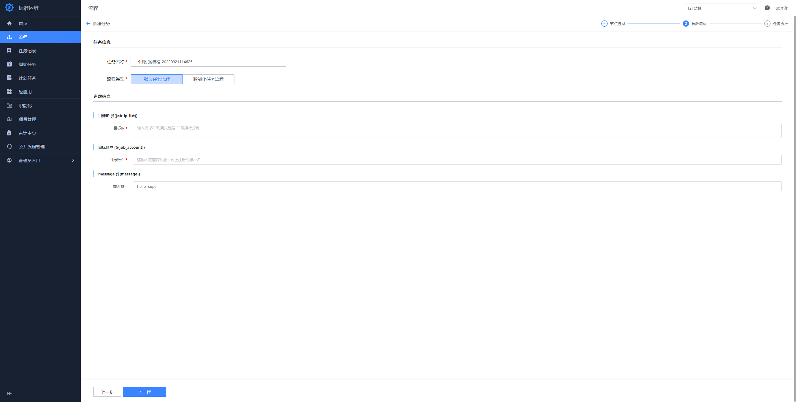
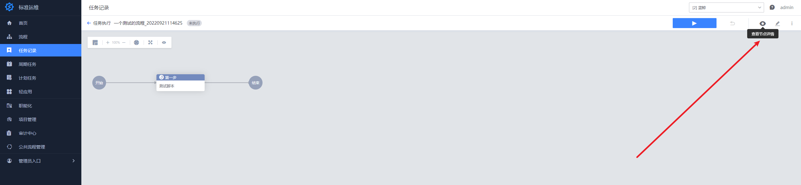
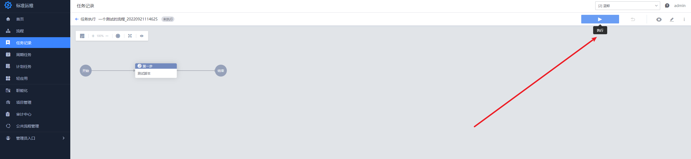

## 第一个流程

在这个章节中，你能够根据指引编排一个调度作业平台的流程，这个流程会到 作业平台 中执行一段脚本。

### 新建流程

进入某个项目的项目流程页面下，点击“新建按钮”。

### 编排流程

在这个流程中我们只使用一个节点调用作业平台执行一段脚本：

双击节点打开配置面板，选择“作业平台(JOB)-快速执行脚本”插件：

1. 配置基础信息，可对节点名称、步骤名称、失败处理、超时控制、是否可选进行配置

   

2. 配置输入参数

   这里我们重点介绍这几点：

   - 在脚本内容中我们使用了${message}语法引用流程中定义的全局变量，变量语法和shell脚本的变量语法相同，但优先级高于shell。
   - 在脚本的目标IP、目标账户我们使用“设置为变量”的功能，为目标IP、目标账户两个字段快速生成了对应的全局变量${job_ip_list}、${job_account}并引用，而不是写死配置。

### 配置全局变量

脚本里我们引用了${message}，现在我们要来配置全局变量：

打开全局变量面板配置${message}变量

完成配置后你的全局变量中应该有这些全局变量：

### 配置流程基础信息（可选）

通过流程基础信息，可配置流程的名称、通知、执行代理人等

### 参数填写

使用流程新建任务时，在参数填写界面按照下图进行填写和配置：

这里我们填入当前业务下的一个合法 IP ，使用root 执行

### 任务执行

完成参数填写和任务创建后，我们会进入到任务详情页面。点击“查看参数”按钮能够预览每个节点的执行参数：

如果配置正确的话，可以看到引用的变量${message}已经被替换成了变量配置的值：

我们还可以对任务的输入参数进行修改：

点击执行按钮开始任务执行：

如果执行中途失败，我们还可对节点进行“重试”或“跳过”操作

如果所有节点执行成功，任务将进入“已完成”状态

