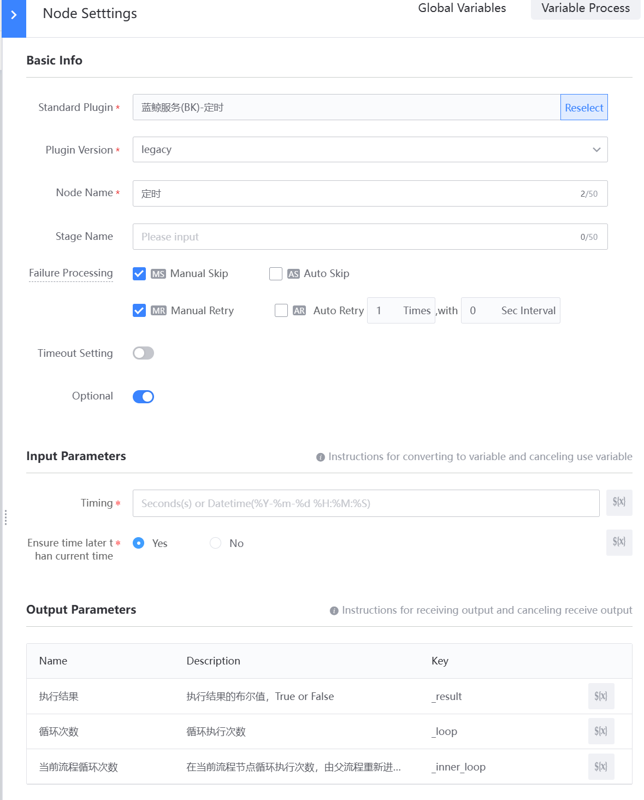
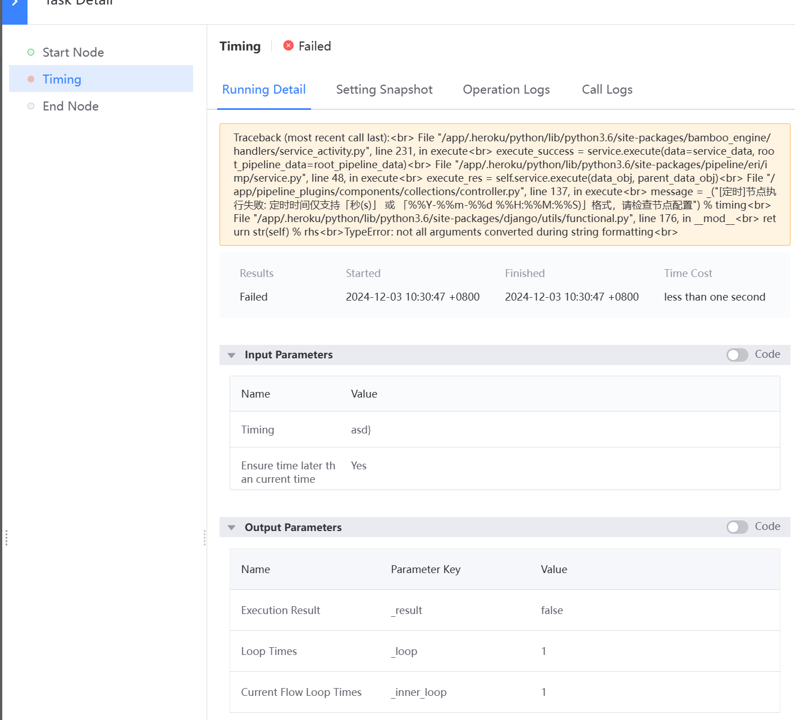

 # Standard Plugin Test 

 Create a Flow template, new a Standard Plugin Node Type Choose the newly Develop standard plug-in as the standard plug-in type, display the same Input Parameters as the Frontend configItem, and Output Parameters as the back-end outputs_format. The execute result is the system default, and the value of True or False indicates whether the node execution result is Success or Failure. 

  

 According to the Flow template Created prev, create a New task and Check the result after execute. 

  

 If the Standard Plugin fails to execute, view the Node pipelinesDetail to Confirm whether it is a Code logic abnormal. 

  

 Then view the App Components Type Log to determine that all exceptions are abnormal by ESB API calls. 