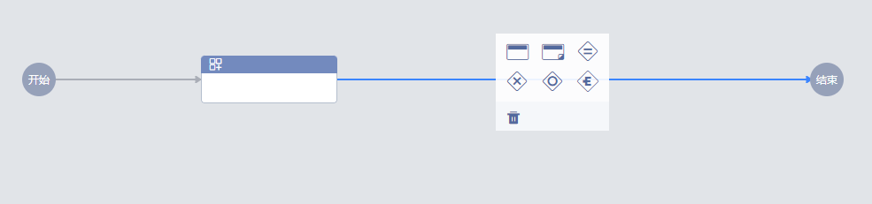
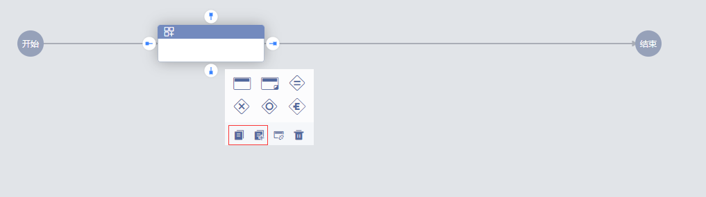
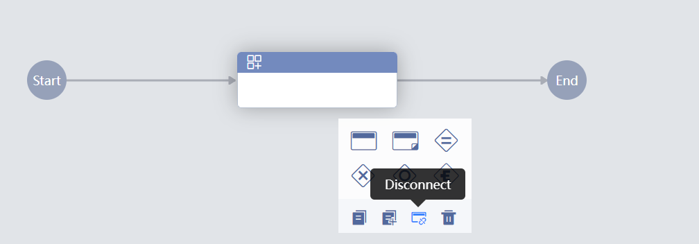
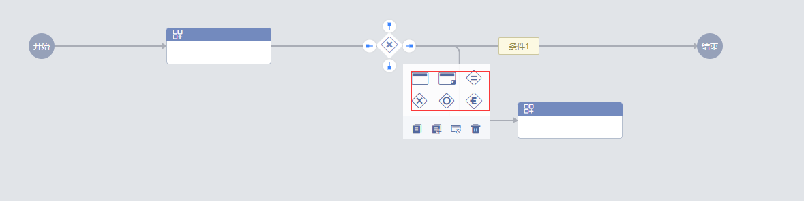
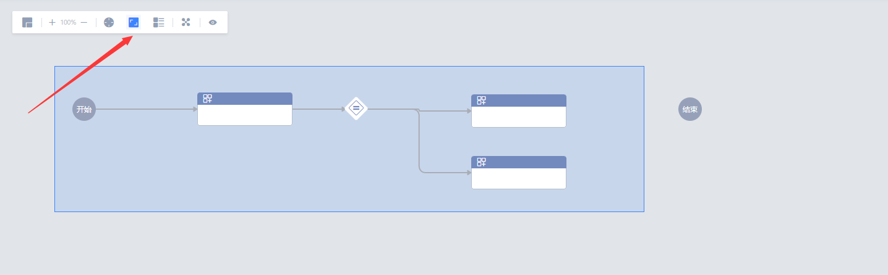
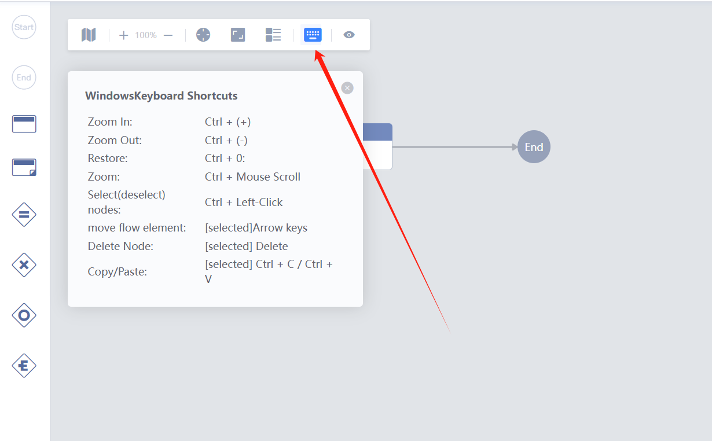

 # [Tips for a quick edit Flow](UserGuide/FAQ/flow-tips.md) 

 - click the Connection and Choose Node insert on the Operation panel 

   

 - Drag a Node onto a Connection to insert 

   

 - copy node, Copy and insert 

   

 - Quickly let the Node disconnect All Connection 

   

 - click the Gateway to quickly Generate a Branch using the Operation panel 

   

 - Quickly Delete multiple nodes 

   

 - Starred shortcut keys 
   