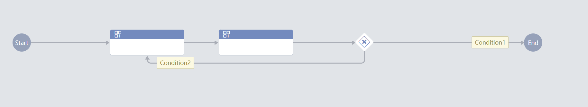
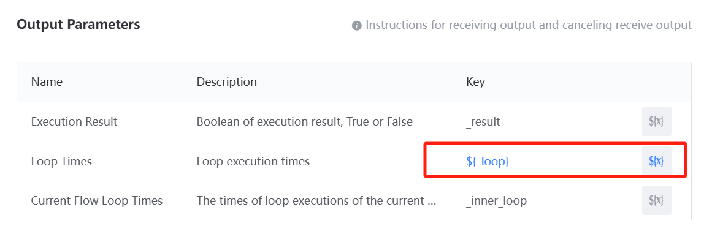
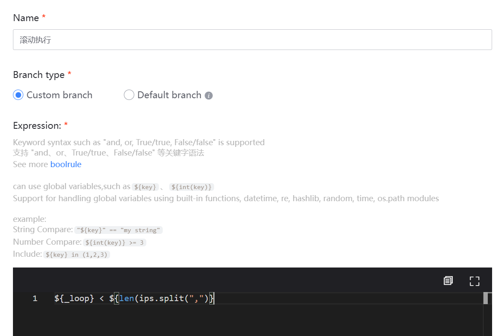
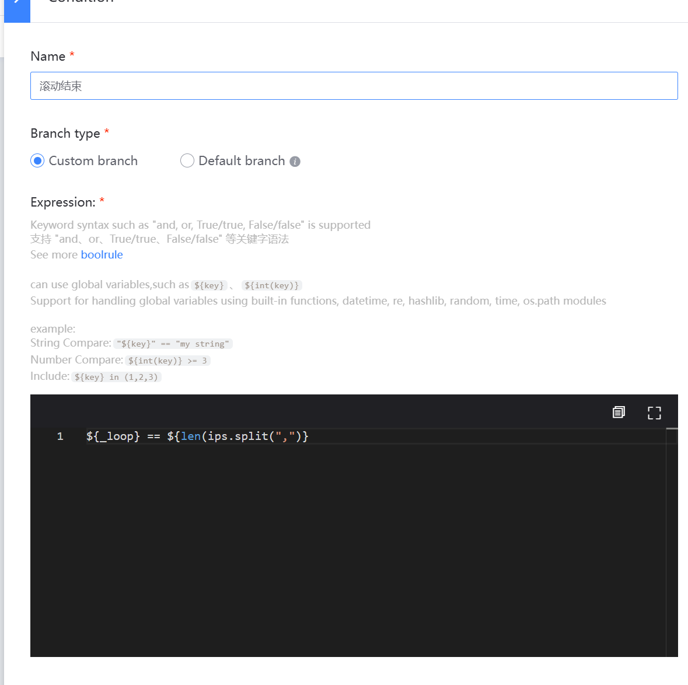
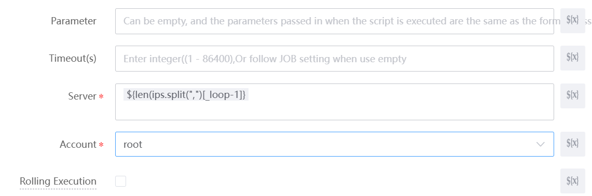

 # How to use the Exclusive Gateway to achieve the effect of circulation 

 In a working Scene, we sometimes need to execute some step in a loop. In this case, we can use a Exclusive Gateway to achieve the effect of the loop. 
 Let's use a loop to achieve the effect of Rolling Execute, one by one for One group of IPs, rather than in parallel. 

 ### 1. Connection One of the branches of the Exclusive Gateway to the loop start Node 

 ### 2. Set the Output Parameters "number of cycles" of the start Node as a Global Variables for judging the cycle Continue/end 

 ### 3. Write a Branch Expression that uses the var $\{\_loop} Output from prev to Set the conditions for Continue and ending the loop 

 loop execute Branch 

 loop end Branch 

 ### 4. Loop Iteration the target IP 

 Tips: You can use the var syntax to achieve higher-order Usage 

 `Use ${len(ips.split(",")} to get the Count of IPs` 
 `Use ${ips.split(",")[_loop-1]} to Iteration IP one by one` 
 