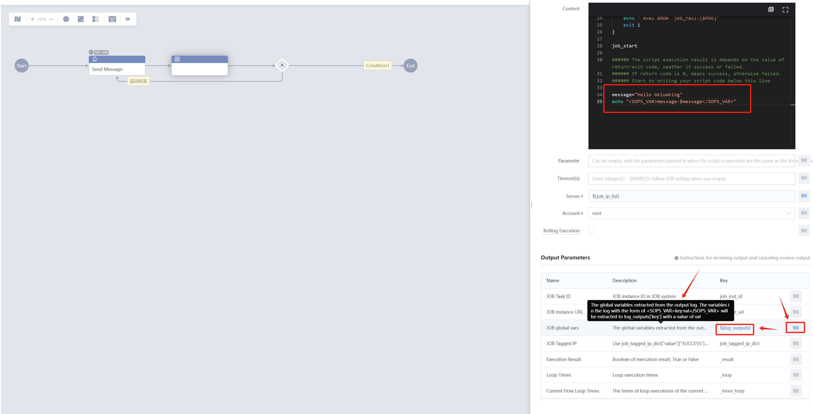
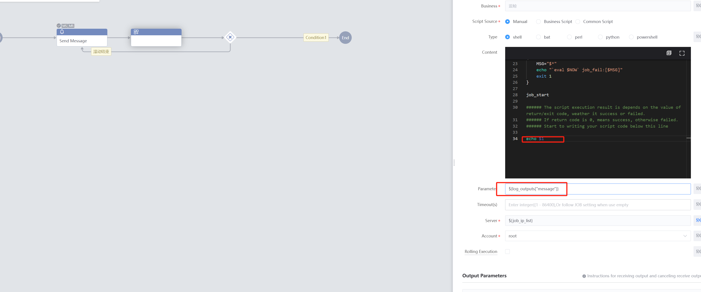
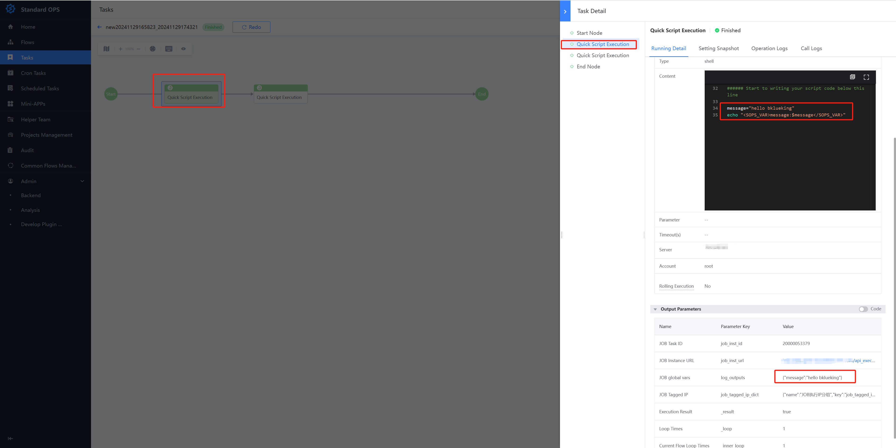
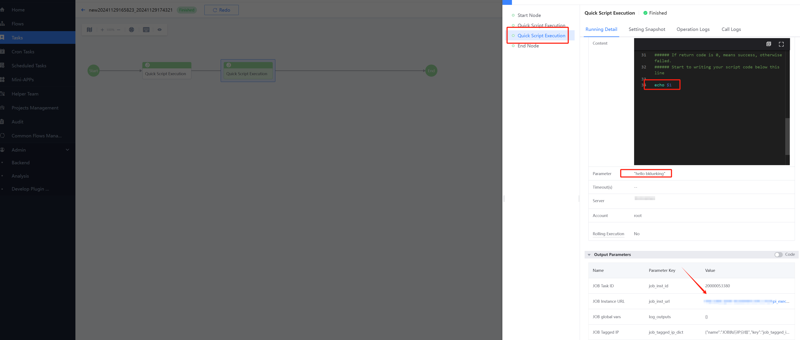
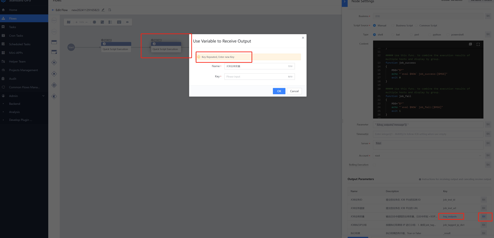
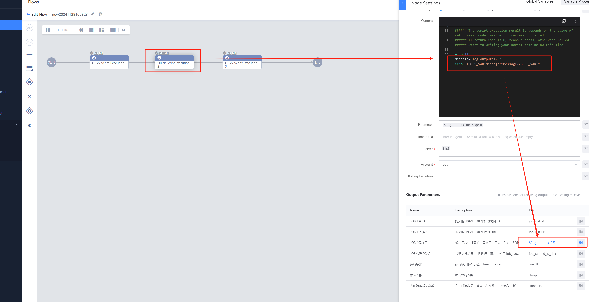
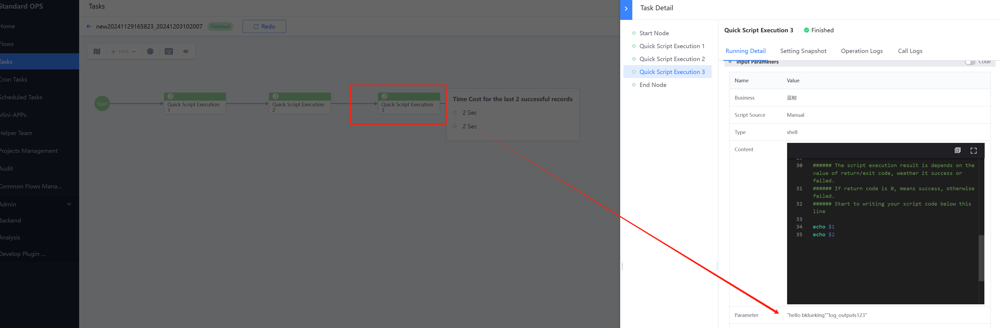

> When a Flow has multiple Step, it is often necessary to pass the result of a previous step to One next or subsequent step (Output as Input). This is the Scene of cross-step parameter passing. Standard OPS approve the unique marking symbol "<SOPS_VAR>key:value</SOPS_VAR>" to achieve this. 

 # Understanding the notation "<SOPS_VAR>key:value</SOPS_VAR>" 

 The usage Scene is to use the Standard OPS symbol " " in the Script. The Data to be passed is included in the symbol in the form of key/value pairs, and is printed to the Log of the Job System using echo/print, etc. Both shell and Python can be used. 

 shell： 
 ``` 
 echo "<SOPS_VAR>key:val</SOPS_VAR>" 
 ``` 

 Python： 
 ``` 
 print("<SOPS_VAR>key:val</SOPS_VAR>") 
 ``` 

 Example: 
 ``` 
 message="hello blueking" 
 echo "<SOPS_VAR>message:$message</SOPS_VAR>" 
 The key "message" corresponds to the value "hello blueking" 
 ``` 

 # Practical demonstration 

 Example: The Standard OPS Flow has two Step. The One step uses the Job System Plugin to execute the Script the Output "hello blueking" content is intended for the Two step. 

 ## 1. step One Use a Script execute simulate the Output of "hello blueking" 
  

 ``` 
 message="hello blueking" 
 echo "<SOPS_VAR>message:$message</SOPS_VAR> 
 ``` 
 (example Code) 

 Output the Global Variables extracted from the Log. Variables in the log such as<SOPS_VAR>key:val</SOPS_VAR> will be extracted into log_outputs ['key '] with the value val. 

 ## 2. step Two approve var to reference the Output of Step One 
  
 ``` 
 echo ${log_outputs["message"]} 
 ``` 
 (example Code) 

 ## 3. execute Effect 
  

 (step One) 

  

 (step Two) 

 You can also click the Job System execute Task Details link to Check the execution result 
  

 The core elements of parameter transfer in different step are the Standard OPS unique marker "<SOPS_VAR>key:val</SOPS_VAR>" and the variable log_outputs. 

 ## Extended Advance Usage 

 - Multiple step need to pass parameters across steps 

 If multiple Step need to use step parameters (for example, the Output of step One needs to be Input to step Two, and the output of step 2 needs to be input to step Three), the KEY in the Output Parameters can be named log_outputs_xxx to avoid duplicate names. 

 For example: 

  

  

  

  

 - One Step has multiple var that need to be referenced by Other steps 

 Multiple var, as long as the key is different, just use<SOPS_VAR>the key:val</SOPS_VAR> syntax, you can definition multiple. 

 For example: 
 ``` 
 echo "<SOPS_VAR>message1:123</SOPS_VAR>" 
 echo "<SOPS_VAR>message2:456</SOPS_VAR>" 
 Then use 
 ${log_outputs ['message 1']} got 123 
 ${log_outputs ['message 2']} got 456 
 ``` 

 - Use Python syntax to handle value, such as specifying newline Separator 

 ``` 
 Example 1: 
 The Raw var is: <SOPS_VAR>message:123| 456| 789</SOPS_VAR> 

 Replace vertical bars with newlines when referencing: 
 ${'\n'.join(log_outputs_xxxx['message'].split('|'))} 

 When the var is execute, the value is: 
 123 
 456 
 789 

 Example 2: 
 The Raw var is: <SOPS_VAR>message:1.1.1.1@name1| 2.2.2.2@name2| 3.3.3.3@name3</SOPS_VAR> 

 When quoting, Replace @ with a space and then replace the vertical bar with a newline: ${'\n'.join(' '.join(log_outputs_xxxx['message'].split('@')).split('|'))} 

 When the var is execute, the value is: 
 1.1.1.1 name1 
 2.2.2.2 name2 
 3.3.3.3 name3 
 ``` 