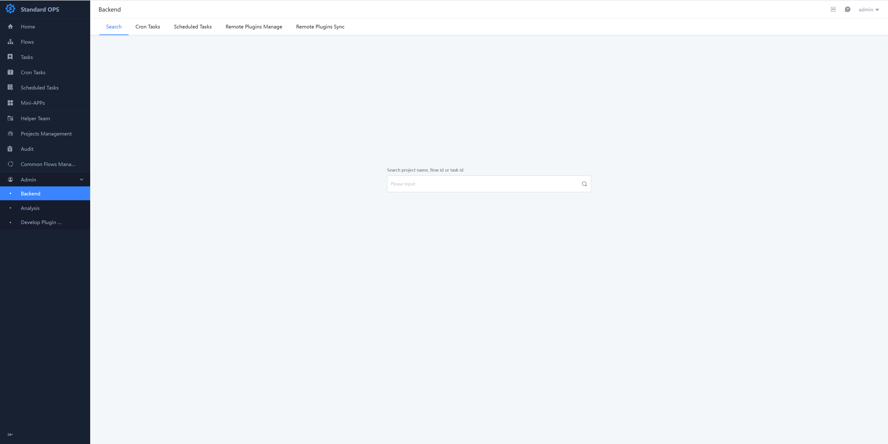
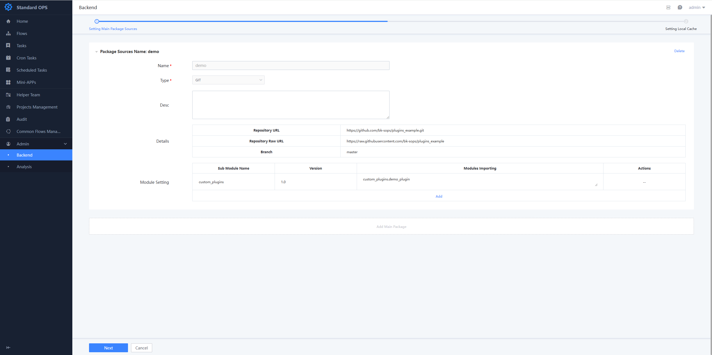
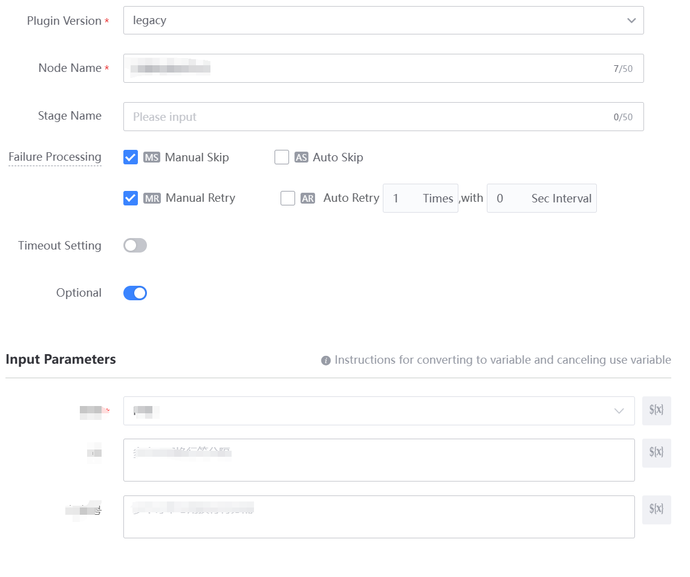
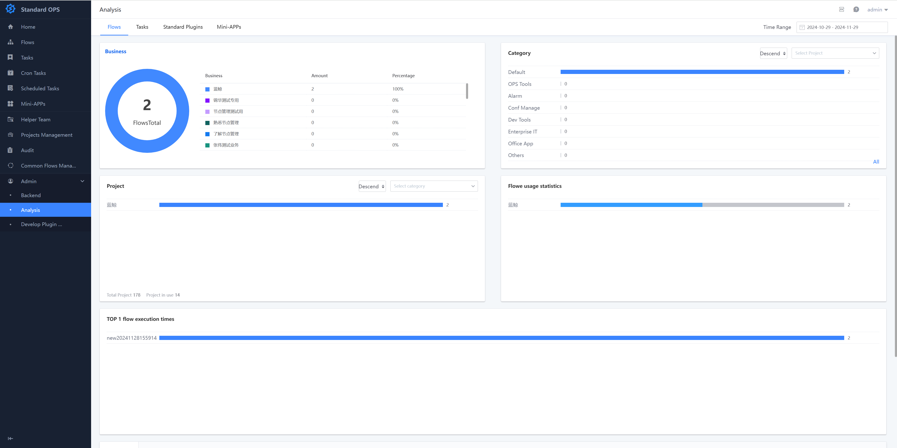
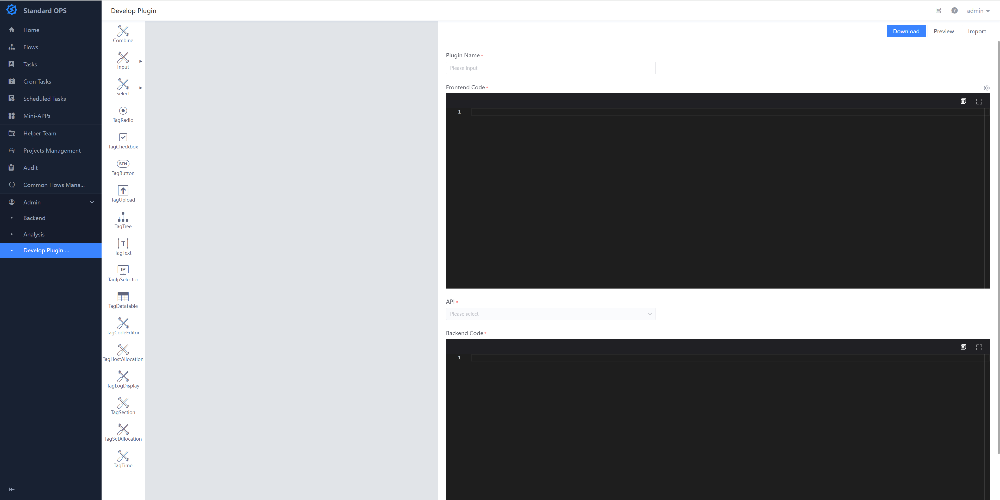

 # Admin 
 ## Backend 

 Includes Search, Scheduled Task, remote Plugin package source Manage, and remote plug-in synchronization. 

 ### Search 

 Here you can Input the Project name, template ID, or Task ID to Search 

  

 ### Scheduled Task 

 Here you can view the Scheduled Task under all project from the Administrator perspective 

  

 ### Remote Plugin Package Source Manage 

 Remote Plugin package source Manage allows user to load third-party plug-ins without Revise the Standard OPS source code, which solves the problem of complex development and maintenance Flow of Standard Plugin. Users can auto load plug-ins by configuring the custom plug-in package source information in the standard OPS after the customize plug-in development Test is complete and Deploy again the application without unzipping the Official package and repackaging. 

 1. setting the master package source information.  On the setting page, fill in the required information 

  

 2. After Deploy again, the Plugin effect is successfully load. edit the default Standard Plugin Node in "add Flow", you can see "customize Atom (CUS)-Test 1" in the remote plug-in package source, and the page renders normal after select The plug-in. 

  

 ## Analysis 

 It includes four Dimension of Analysis analysis: Flow statistics, Task statistics, Standard Plugin stat and Mini-App statistics. 

  

 ## Develop Plugin 

 Here you can Develop Plugin by visually dragging and dropping Starred forms 

  