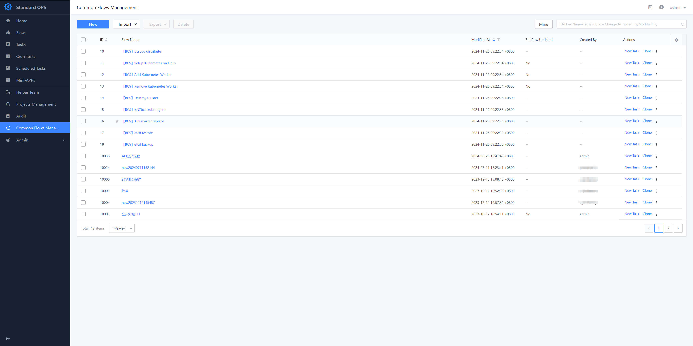
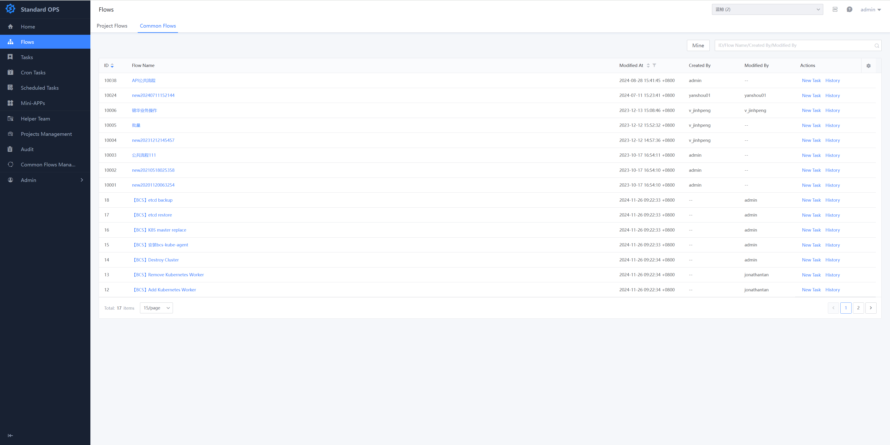
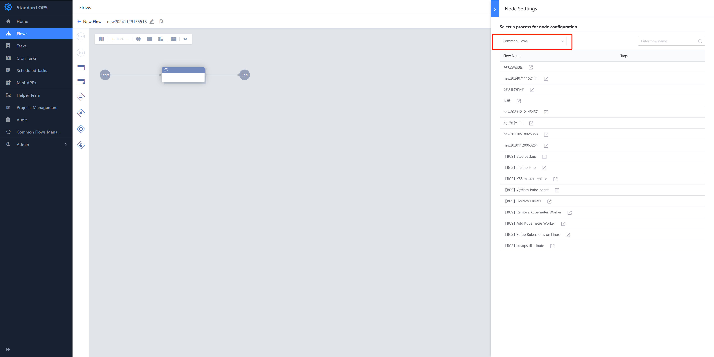
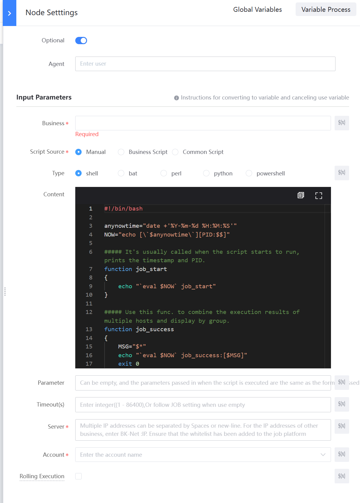

 ## Common Flow 

 Common Flow are typically Manage by members of a common team to manage the Base processes that are expected to be general across All project to avoid duplication. 

 > Public Process Management can only be Enter if you have the Common Flows Management auth (add/Edit/Delete): 

  

 ### View and referencing Common Flow under a Project 

 The Manage of the Common Flow is identical to the Project Flow.  After the public Created is complete, you can Check and New task execute in the Common Flow/B tab under the Project 

  

 The Common Flow can also be referenced as a Subflow, so that the atomic process provided by the common team and the Business Name process complete. 

  
 
 ### Common Flow auth 

 To implement the use of a Common Flow in a Project, the public process provided needs to consider whether the user has the corresponding auth 

 - Standard OPS: Users of Common Flow need to have two auth: view Public Process and Create Public Process Task 
 - Other systems: Users of the Common Flow are also subject to auth the backend system that the Standard Plugin interfaces with 

 Taking the Job System Plugin as an example, **the Common Flow provided** needs to consider the following constraints: 

 - By default, the Job System only Allow Resource such as execute schemes and Script to belong to the same Business Name (set) as the execution target (IP). 
 - To transfer file from Other Business Name machines, you need to enable the "File Distribution" whitelist in "Job System-Platform Manage- IP whiteList" 
 - To execute scripts on Other Business Name machines, you need to enable the "Script Execution" whitelist in "Job System-Platform Manage- IP whiteList" 

 #### The Case: 

 Two points to note In the use: 

 - When a Common Flow provided edit a public process, it cannot obtain the Business Name in which it is actually execute.  We need to Set the Business Name Field as a var.  When it is actually execute, the system will auto fill in the current Business Name 
 - The IP Input by the target Service needs to belong to the current Business Name.  If it is not the current Business Name IP, please use the Cloud area: Input the IP format and enable whitelist in "Job System-Platform Manage- IP whiteList" 

  