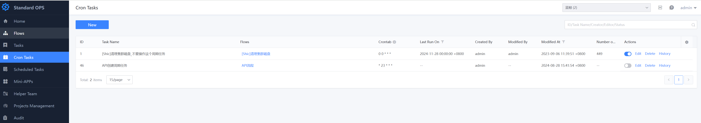
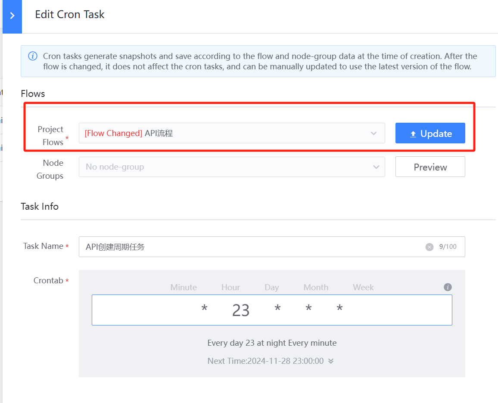

 # Scheduled Task 

 Scheduled Task can meet the needs of user to execute tasks According to specific period. 

 

 1. Add Scheduled Task. A recurring task has Three important components 

   - Flow to be execute 
   - Periodic Expression, the expression is exactly the same as Crontab 
   - Input parameter of the Flow to be execute 

  

 2. Update Scheduled Task 

 - The snapshot Data of the Flow is used when the Scheduled Task is create. When the process is changed, the periodic task will prompt the process Updated, but the link snapshot will not be Automatic update. 

  You can Update the Flow approve edit Scheduled Task. 

 - In addition to Update Flow, you can also update information such as cycle Expression and Parameter 

  