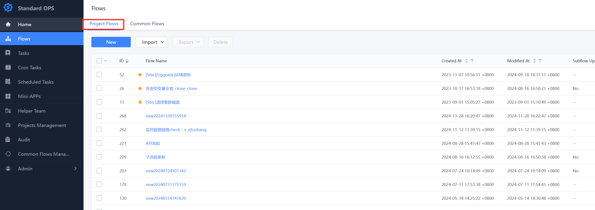
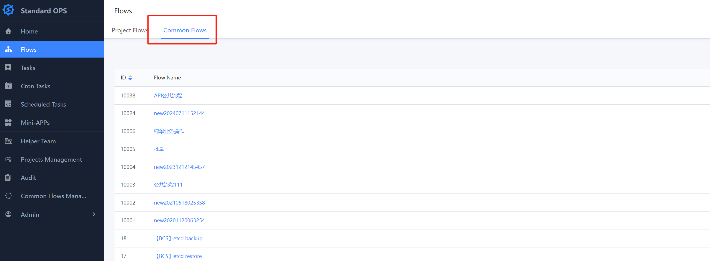
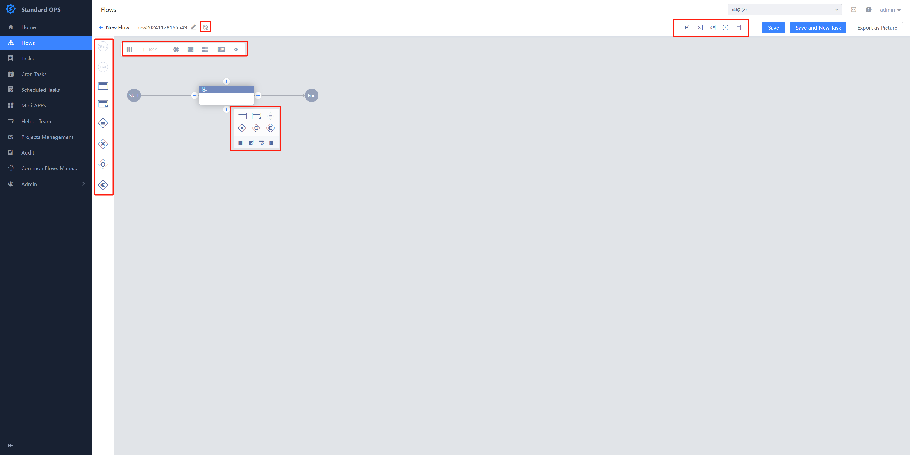
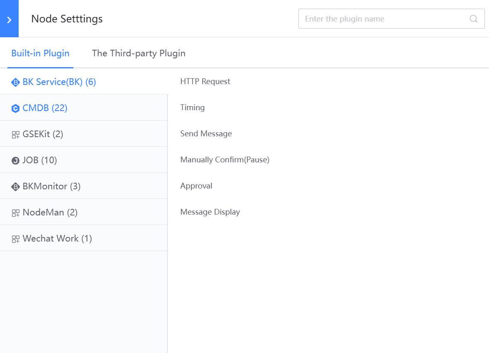
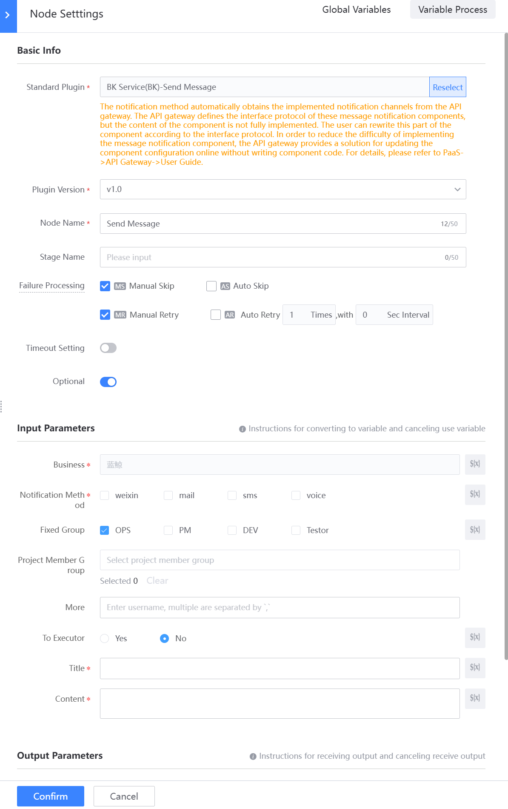
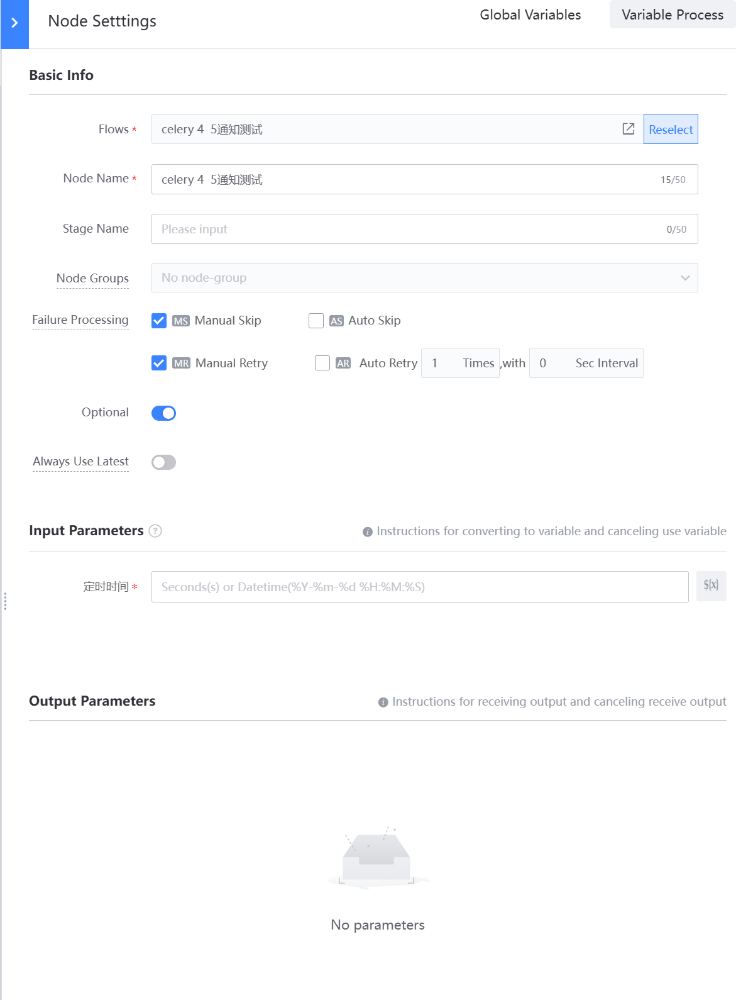
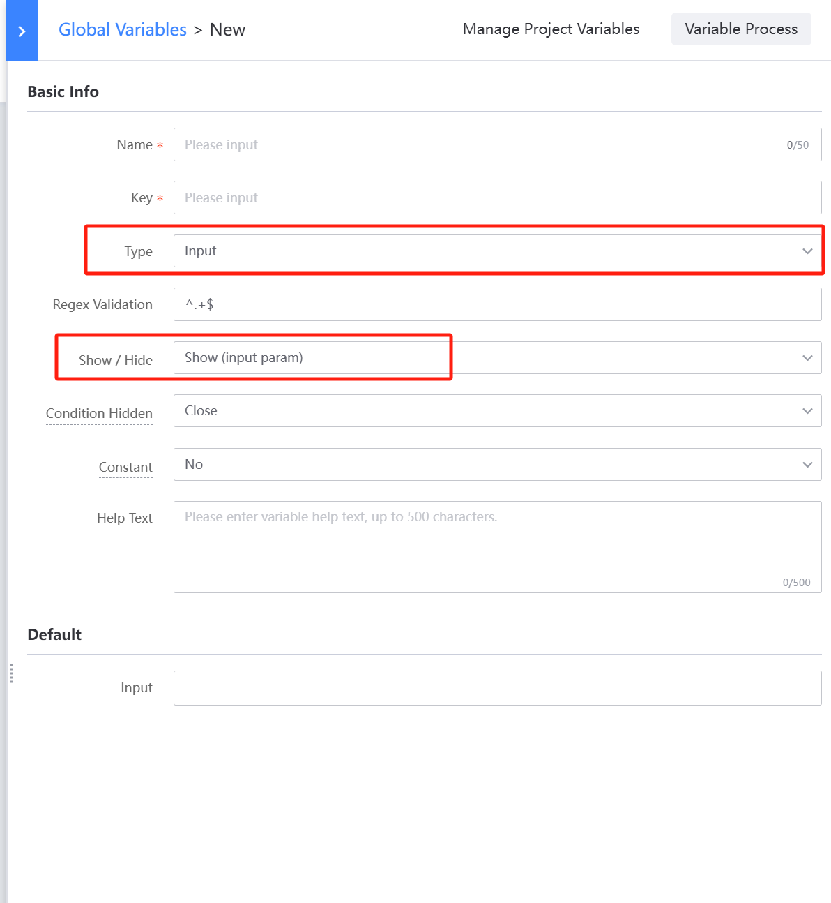
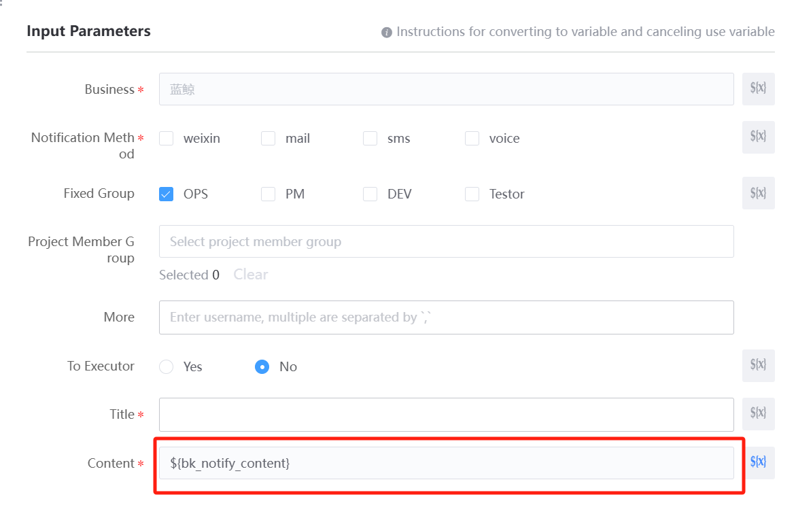

 ## Flow 

 ### Flow is the core function of Standard OPS. It is divided into Project Flow and Common Flow 

 1. The Project Flow shows a list of processes under The current project 

  

 2. Common Flow show All the common processes available under the Project.  A Common Flow is Manage by a public process provided and cannot be edit under a Project. It can be execute independently or referenced as a Subflow. 

  

 ### Flow edit: user can finish process editing approve the visual interface. 

  

 ### Flow Composition: The process consists of Control Node, Standard Plugin node, Subflow node and Connection 

 1. The Flow Control Node is the skeleton of the process, including: 

   - Start Node--Identifies the start of the Flow 
   - End Node--Identifies the end of the Flow 
   - Parallel Gateway--identifies the start of parallel execute 
   - Exclusive Gateway--identifies the start of branch execute 
   - Conditional Parallel Gateway--Identifies the start of a conditional parallel Branch 
   - Converge Gateway-Identifies the end of a parallel or Branch 

 2. Standard Plugin Node 

   - The Standard Plugin Node is the smallest built-in unit of execute, and each node can Choose One plug-in to use.  Some Plugin are built into the Standard OPS and maintenance for out-of-the-box use 

    

   - The core of the node configuration is to configure the Input Parameters of the Plugin 

  

 3. Subflow Node 

 - A Subflow Node is OK process.  When edit Flow, we can nest and reference other processes as Subflow node 

  

 4. Global Variables 

   - Global Variables are the Common Params of One Flow, and are approve to implement unified setting Manage.  user can reference the Node's Input Parameters and Exclusive Gateway Expression by approve ${Key}. Standard OPS will auto Replace the value with the Global Variables when execute Task. 
   - customize Global Variables, you can select Input box, textarea, date Time, integer, IP selector and other different type.  When Set to Show (Input Parameter), it is used as the input parameter of the Task and passed in during execute. 

    

   - Input Parameter Settings as a var. You can set a Number of fields of the Plugin as a variable.  It has two main functions: 

     - Quickly Created One var and reference it 
     - You do not want to fix a configuration when Configuration, but pass it in during execute 
        

   - The Output Parameter Settings to a var, and the output of the Node can be used by subsequent nodes only after it is set to a variable 