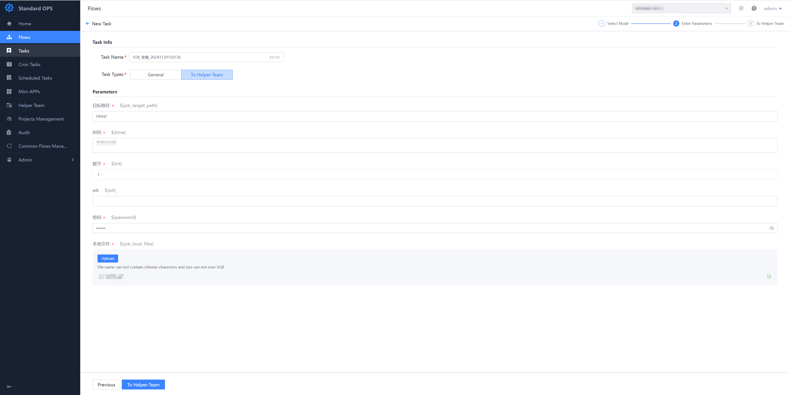
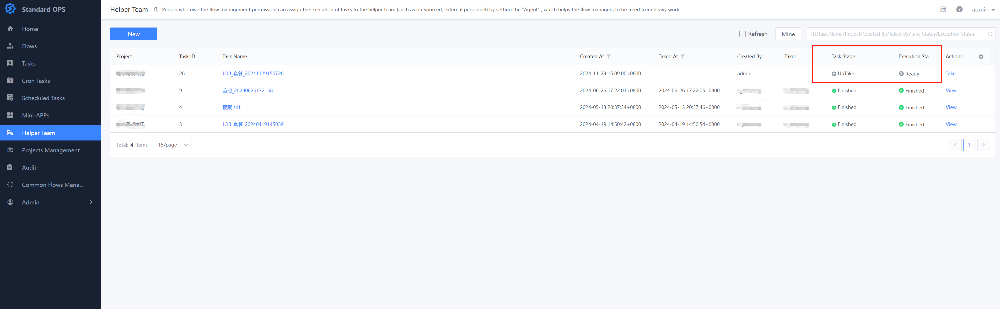
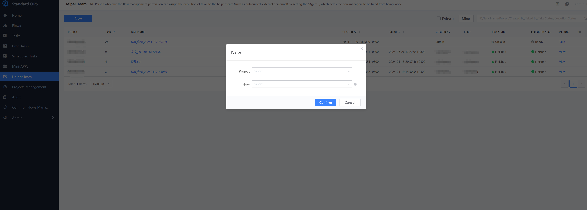

 ## Helper Team 

 The Helper Team center allows the personnel with Flow Manage auth to delegate the Operation of process Task to the third-party personnel (such as: Outsourcing, external personnel) to help Flow Manage from the heavy execute of the release 

 > User users with the "view Helper Team Center" auth can Enter the Functional Center page 

  

 ### How to Created Helper Team Task 

 - When New task, Choose the task Type Revise it to BFunctional/Helper Team. After Fill In in the Parameter, submit the task to BFunctional/B. The task will enter the BTo Be Claimed/B status in the functional center and wait for claim 

  
  

 - Helper Team people can also actively Create Task on the functional page 

 Flow view and Process New task auth are required 

  