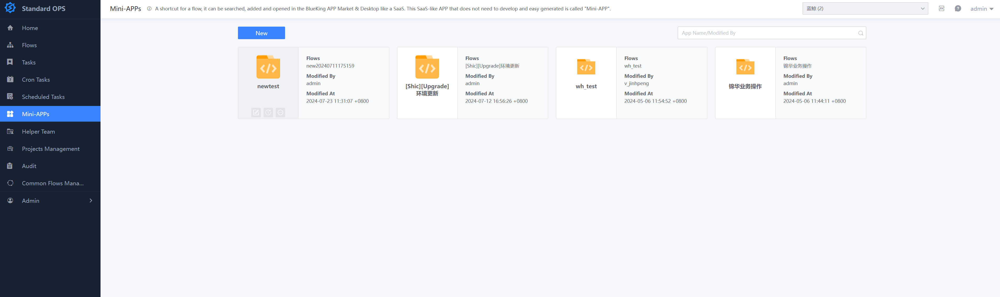
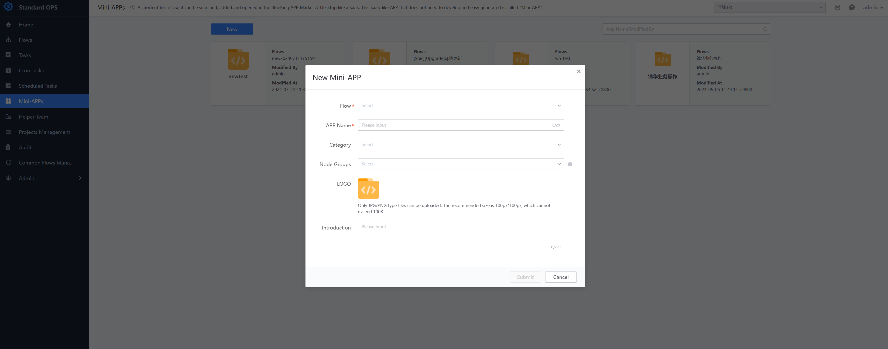
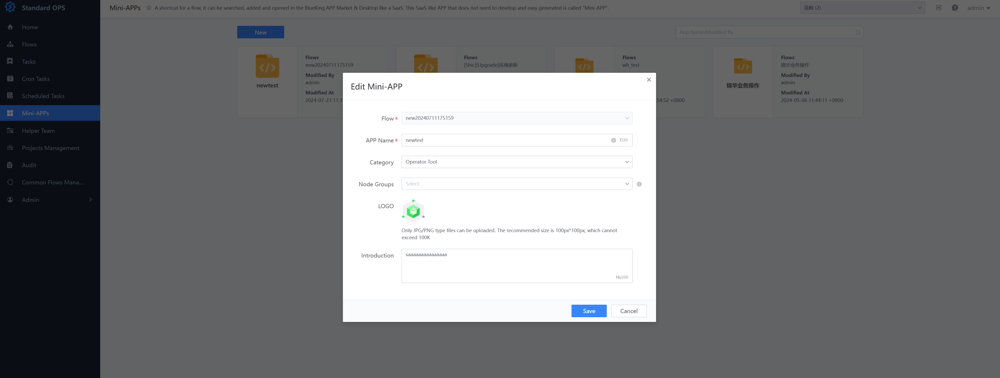

 # Mini-App 

 One Shortcut to Flow Task, which are Generate based on the process and can be directly search, append and opened in SaaS mode in the BlueKing APP Market & Desktop.  This kind of SaaS Apply that does not need to be Develop and is quickly Generate is called "Mini-App".  approve deep integration with BlueKing PaaS platform, Standard OPS greatly improves the self-service capability of Business Name and facilitates non-technical personnel to execute daily work. 

  

 In the Mini-App page, users can Created a light application based on One execute Task and send it to the specified user's BlueKing workbench (if it is an enterprise version, it will be Display in the "Application Market" of BlueKing Desktop, and users can append it to their Personal desktop). 

 ## Add Mini-App 

 Users can Choose One Flow template Created a Mini-App. After the light application is created, it will be displayed directly on the user's BlueKing workbench.(If it is the enterprise version, it Display in the "Application Market" on the BlueKing Desktop, and user can append it to their Personal desktop). For users, Mini-App only need to pay attention to the Parameter Fill In and Task Operation of One Flow template. Because the page is concise and friendly enough, a non-technical person can also execute tasks approve light applications. This is one of the self-service service provided by Standard OPS. 

 > Note that you can access a lightweight application only after you have Apply the View Lightweight Application and View Process permission of its corresponding template in the permission center. If you need a user to Create Task and execute tasks approve a lightweight application, please apply for the View Lightweight Application and Create Lightweight Application Task permissions of The lightweight application and View Process permission of the template corresponding to the lightweight application in the permission center in advance. 

  

 ## Edit Mini-App 

 If you need to Revise the Name, summary or Logo of a Mini-App, Choose the lightweight application to be modified in the list of lightweight applications, click the edit icon, and Fill In the modified Parameter in the pop-up window. 

 > Note that the Flow template referenced by a Mini-App cannot be Revise. If you need to do so, Delete the old lightweight application and create a new lightweight application, and reference the new process template. 

  

 ## Delete Mini-App 

 If you need to Delete Mini-App, Choose the light application to be Revise in the Standard OPS light Application List approve the mouse, click the delete icon, and Confirm and delete it Two in the pop-up window. After successfullyDeleted, the light application in Personal Workbench (BlueKing Desktop) will be deleted synchronously. 