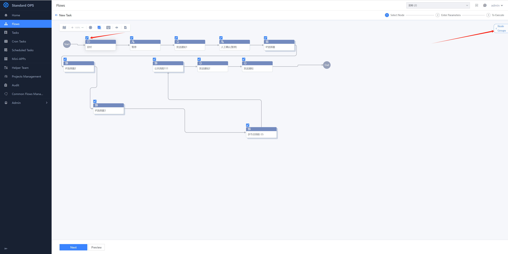
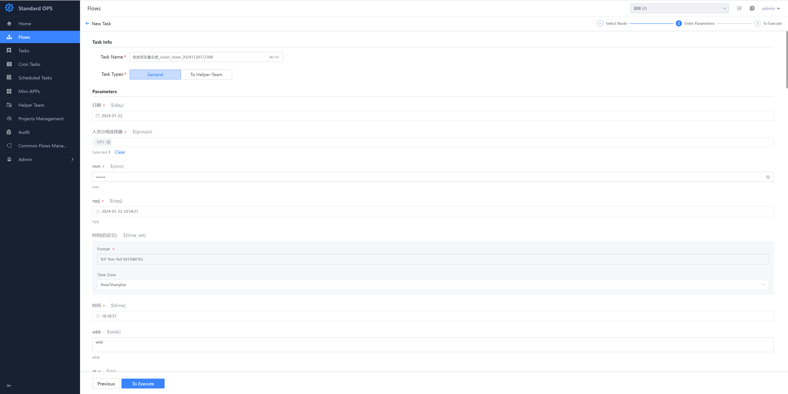
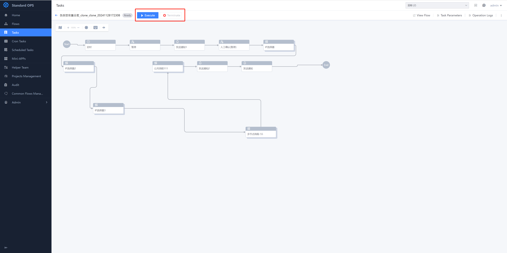
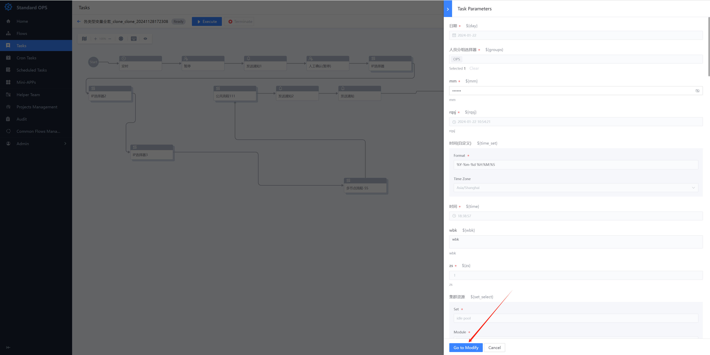
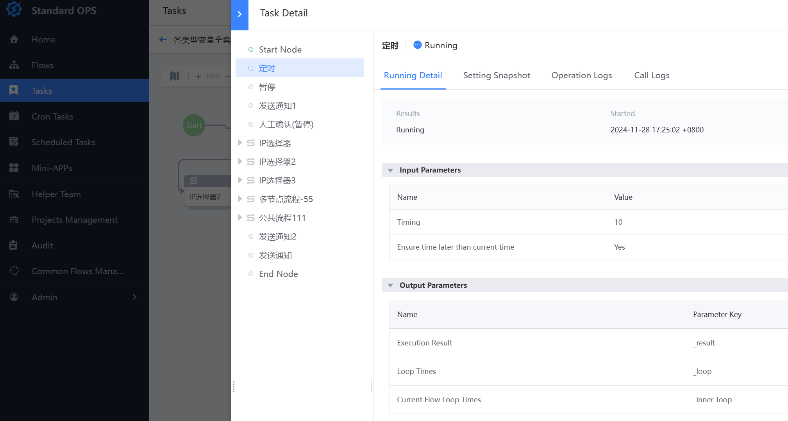
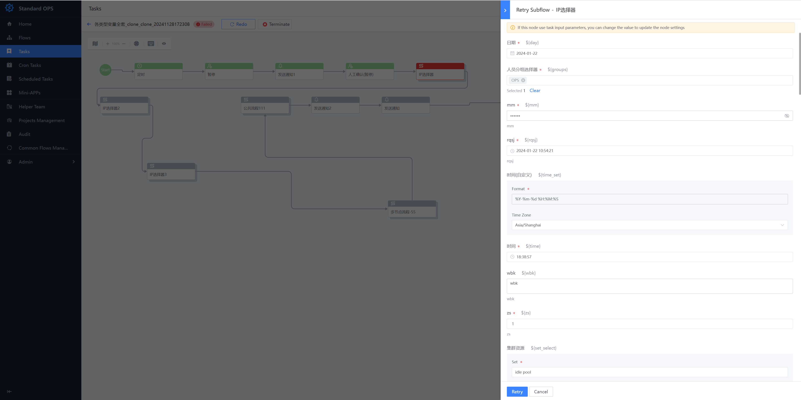
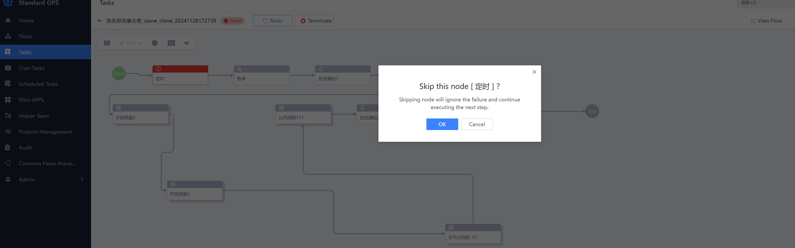

 # New task 

 The Flow is just One template, and we need to instantiate the process, which results in a Task.  The user can click the "New task" button of the Flow Created One task 

 ### Step: **select a Node-Fill In Parameter-Operation Task** 

 1. select node. all nodes are selectAll by default.   
  - manual check   
   - select the execute scenario that has been create   
    - Use a One time protocol 

 > You can Set whether the node is optional during Configuration. 

  

 2. Fill In Parameter 

  

 3. When a Task execute, you can perform various Operation on the task and the Node 

   - Start Up, PAUSE, terminate 

    

   - view and Revise Task input parameters 

    

   - view Node pipelinesDetail     
    

   - retry or SKIP the Failure Node      Only Task input parameters Allow be Revise when retry 

    

    