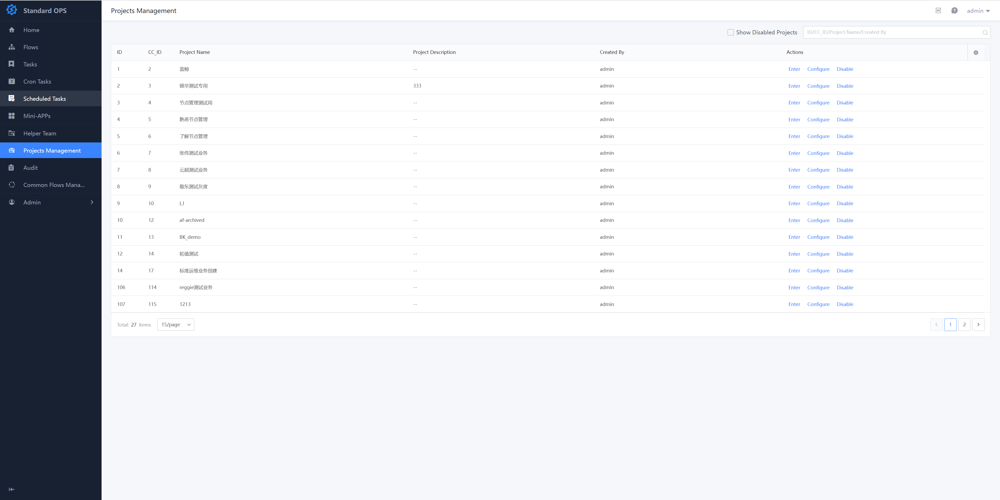
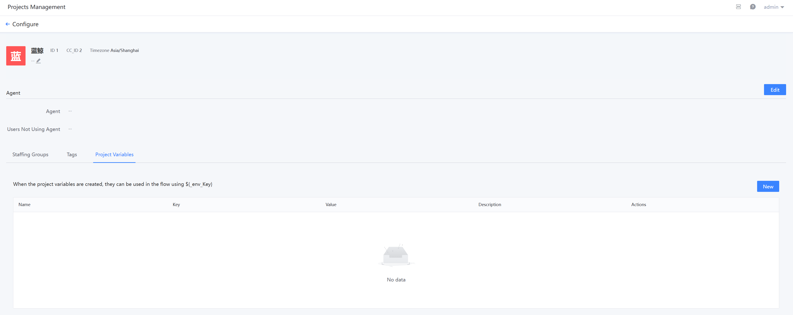

 ## ProjectManage 

 The projectManage interface displays All the projects you have auth to Check. You can Check, Edit and Disable the Operation on the project management page: 

  

 Project setting can Set agents, personnel group, label, var, etc. at the project level: 

  