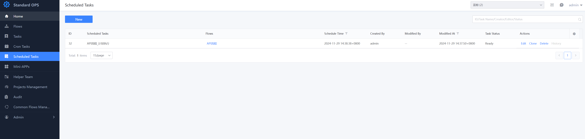
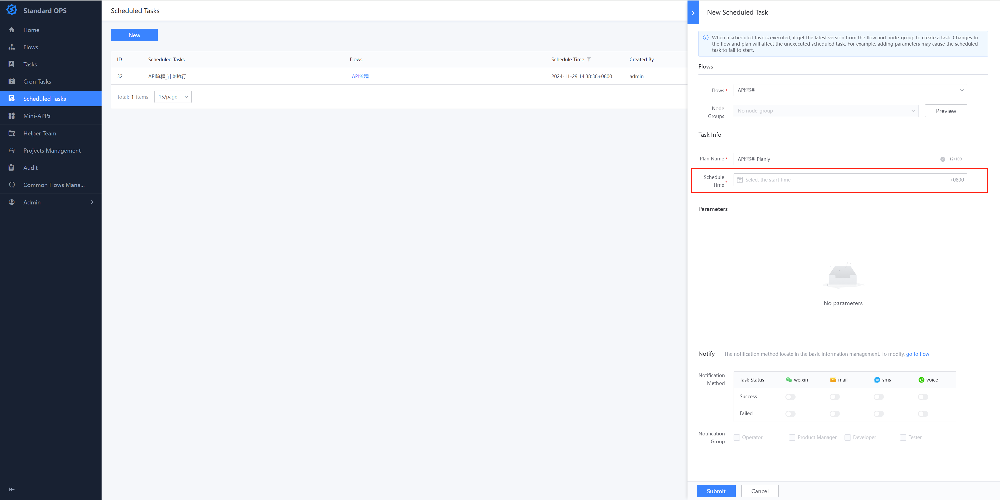

 # One-Time Scheduled Task 

 One-Time Scheduled Task can meet the user's requirements for the Flow to be executed at a planned Time point. 

  

 1. Add One-Time Scheduled Task, which also has Three components 

   - Flow to be execute    - Start Time    - Input parameter of the Flow to be execute 

  

 2. Edit One-Time Scheduled Task 

 User can Edit One-Time Scheduled Task to Revise lastExecTime and Parameter information 

 > Note: The One-Time Scheduled Task can only be edit when its Status is unexecute 

 3. Update Flow link with One-Time Scheduled Task 

 One-Time Scheduled Task execute always Create Task with The latest version of Flow, so noNeedToUpdate. 
 
  