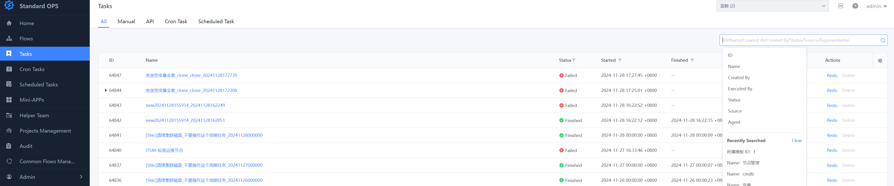
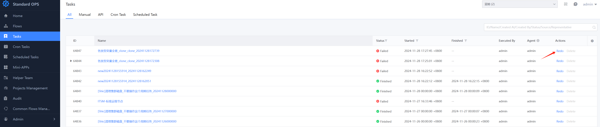

 # Tasks 

 In the Tasks page, user can trace the historical task execute status and support multiple Search criteria 

  

 ### Re-run 

 - You can initiate execution of an already execute Task again. The variableVal will be reused as much as possible and the Create Task Flow the latest process 

  